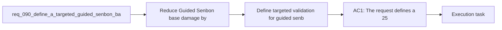

## item_338_define_targeted_validation_for_guided_senbon_lower_damage_and_faster_cadence - Define targeted validation for guided senbon lower damage and faster cadence
> From version: 0.6.0
> Schema version: 1.0
> Status: Done
> Understanding: 100%
> Confidence: 97%
> Progress: 100%
> Complexity: Low
> Theme: Gameplay
> Reminder: Update status/understanding/confidence/progress and linked task references when you edit this doc.

# Problem
- Reduce `Guided Senbon` base damage by 25 percent.
- Reduce the time between `Guided Senbon` attacks by 25 percent so the skill fires more often.
- Keep the change tightly scoped to one targeted balance adjustment rather than reopening a broad first-wave weapon rebalance.
- `Guided Senbon` is one of the first-wave active weapons and currently reads as an auto-targeted precision burst. The authored tuning surface in the runtime build system currently sets:
- - base damage to `15`

# Scope
- In:
- Out:

# Acceptance criteria
- AC1: The request defines a 25 percent reduction to `Guided Senbon` base damage relative to its current authored baseline.
- AC2: The request defines a 25 percent reduction to the time between `Guided Senbon` attacks relative to its current authored baseline.
- AC3: The request keeps the slice bounded to `Guided Senbon` and does not widen into a roster-wide rebalance.
- AC4: The request keeps the role of `Guided Senbon` as a faster precision auto-target weapon rather than changing its core function.
- AC5: The request defines validation expectations strong enough to later prove that:
- the weapon deals less damage per attack than before
- the weapon attacks more frequently than before
- the authored tuning source and runtime behavior stay aligned after the change

# AC Traceability
- AC1 -> Scope: targeted validation asserts the tuned runtime stats directly from the authored build-system definition. Proof: `games/emberwake/src/runtime/buildSystem.test.ts`.
- AC2 -> Scope: the validation suite confirms the faster attack cadence through the resolved `cooldownTicks` value. Proof: `games/emberwake/src/runtime/buildSystem.test.ts`.
- AC3 -> Scope: validation stayed bounded to `Guided Senbon` and did not widen into a roster-wide rebalance suite. Proof: executed commands were limited to targeted runtime tests plus shared UI/model checks and `npm run typecheck`.
- AC4 -> Scope: validation confirms the weapon still resolves with the same attack posture while only damage and cadence changed. Proof: `games/emberwake/src/runtime/buildSystem.ts`, `games/emberwake/src/runtime/buildSystem.test.ts`.
- AC5 -> Scope: validation is strong enough to prove the intended tuning change end to end. Proof: `npm run test -- src/app/model/metaProgression.test.ts src/app/components/AppMetaScenePanel.test.tsx src/app/components/ShellMenu.test.tsx games/emberwake/src/runtime/buildSystem.test.ts`.
- AC6 -> Scope: per-attack damage is lower than before. Proof: `games/emberwake/src/runtime/buildSystem.test.ts`.
- AC7 -> Scope: attack cadence is faster than before. Proof: `games/emberwake/src/runtime/buildSystem.test.ts`.
- AC8 -> Scope: runtime behavior stays aligned with the authored tuning source. Proof: `games/emberwake/src/runtime/buildSystem.ts`, `games/emberwake/src/runtime/buildSystem.test.ts`.

# Decision framing
- Product framing: Not needed
- Product signals: (none detected)
- Product follow-up: No product brief follow-up is expected based on current signals.
- Architecture framing: Consider
- Architecture signals: data model and persistence
- Architecture follow-up: Review whether an architecture decision is needed before implementation becomes harder to reverse.

# Links
- Product brief(s): (none yet)
- Architecture decision(s): (none yet)
- Request: `req_090_define_a_targeted_guided_senbon_balance_adjustment_for_lower_damage_and_faster_cadence`
- Primary task(s): `task_063_orchestrate_guided_senbon_lower_damage_and_faster_cadence_tuning`

# AI Context
- Summary: Define a narrow Guided Senbon tuning change that reduces damage per hit and shortens time between attacks.
- Keywords: guided senbon, balance, damage, cooldown, cadence, tuning, gameplay
- Use when: Use when framing scope, context, and acceptance checks for a bounded Guided Senbon micro-balance change.
- Skip when: Skip when the work targets another feature, repository, or workflow stage.

# Priority
- Impact:
- Urgency:

# Notes
- Derived from request `req_090_define_a_targeted_guided_senbon_balance_adjustment_for_lower_damage_and_faster_cadence`.
- Source file: `logics/request/req_090_define_a_targeted_guided_senbon_balance_adjustment_for_lower_damage_and_faster_cadence.md`.
- Request context seeded into this backlog item from `logics/request/req_090_define_a_targeted_guided_senbon_balance_adjustment_for_lower_damage_and_faster_cadence.md`.
