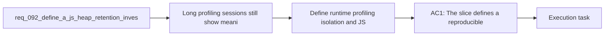

## item_339_define_long_session_runtime_profiling_isolation_and_retained_js_owner_attribution_for_heap_growth - Define long-session runtime profiling isolation and retained JS owner attribution for heap growth
> From version: 0.6.0
> Schema version: 1.0
> Status: Ready
> Understanding: 100%
> Confidence: 96%
> Progress: 0%
> Complexity: High
> Theme: Runtime
> Reminder: Update status/understanding/confidence/progress and linked task references when you edit this doc.

# Problem
- Long profiling sessions still show meaningful JS heap growth even after the profiling harness stall was fixed.
- The current heap evidence is directionally useful but still too generic: most retained buckets are minified or broad JS shapes such as `Object`, `Array`, and `heap number`.
- Without a bounded isolation and attribution slice, any optimization wave risks changing large runtime surfaces without proving which subsystem is actually responsible.
- This backlog item exists to make the memory signal actionable before the main reduction wave changes proven runtime hotspots.

# Scope
- In:
- Define a reproducible profiling matrix for the remaining memory signal, including at minimum the current pendulum run and a reduced-pressure baseline such as a no-spawn traversal scenario.
- Capture and compare profiling artifacts so simulation-heavy, shell-heavy, and render-heavy signatures can be separated more credibly.
- Attribute the most suspicious retained heap constructor families to meaningful code ownership through source maps, a readable profiling build, or another bounded attribution method.
- Produce a ranked suspect list that can drive the next reduction slice without widening blindly into unrelated systems.
- Out:
- Broad code optimization before the most likely retained owners are identified.
- Native renderer memory tuning unless the new evidence contradicts the current JS-heavy signal.
- Gameplay, economy, progression, or world-generation work unrelated to memory attribution.

# Acceptance criteria
- AC1: The slice defines a reproducible profiling matrix for the remaining memory signal, including at minimum one normal-pressure long session and one reduced-pressure comparison run.
- AC2: The slice defines that each profiling comparison captures enough shared evidence to compare heap growth, runtime tick stability, and live runtime population.
- AC3: The slice defines that minified or generic retained constructor families from the heap snapshots are attributed to meaningful code ownership before broad optimization decisions are made.
- AC4: The slice defines a ranked suspect list with explicit ownership hypotheses strong enough to drive the next coherent reduction wave.
- AC5: The slice stays diagnostic and attribution-focused and does not widen into speculative renderer rewrites or unrelated gameplay work.

# AC Traceability
- AC1 -> Scope: the backlog requires a bounded profiling matrix instead of a single anecdotal run. Proof target: profiling scripts, captured artifacts, and notes linked from `task_064_orchestrate_long_session_js_heap_retention_investigation_and_reduction`.
- AC2 -> Scope: shared evidence must include heap, tick stability, and runtime population so comparisons are not reduced to one raw heap number. Proof target: profiling summary artifacts and task report.
- AC3 -> Scope: constructor attribution must turn minified buckets into actionable code ownership before broad optimization. Proof target: profiling notes, source-map or readable-build attribution evidence, and linked implementation notes.
- AC4 -> Scope: the slice ends with a ranked suspect list to drive the next reduction step. Proof target: task report and linked follow-up work notes.
- AC5 -> Scope: optimization is intentionally deferred until attribution is good enough. Proof target: changed surface remains bounded to profiling and attribution support.

# Decision framing
- Product framing: Not needed
- Product signals: (none detected)
- Product follow-up: No product brief follow-up is expected based on current signals.
- Architecture framing: Not needed
- Architecture signals: (none detected)
- Architecture follow-up: No architecture decision follow-up is expected based on current signals.

# Links
- Product brief(s): (none yet)
- Architecture decision(s): (none yet)
- Request: `req_092_define_a_js_heap_retention_investigation_and_reduction_wave_for_long_runtime_profiling_sessions`
- Primary task(s): `task_064_orchestrate_long_session_js_heap_retention_investigation_and_reduction`

# AI Context
- Summary: Define the profiling isolation and retained-owner attribution slice that makes the remaining JS heap growth actionable.
- Keywords: heap, profiling, isolation, attribution, sourcemap, runtime, long session, memory
- Use when: Use when implementing or reviewing the diagnostic slice for long-session JS heap retention.
- Skip when: Skip when the change is unrelated to this delivery slice or its linked request.

# Priority
- Impact: High
- Urgency: Medium

# Notes
- Derived from request `req_092_define_a_js_heap_retention_investigation_and_reduction_wave_for_long_runtime_profiling_sessions`.
- This slice should land before or alongside the main churn-reduction slice so follow-up optimization stays evidence-led.
