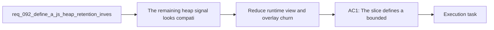

## item_340_define_targeted_runtime_view_and_overlay_churn_reduction_for_long_session_js_heap_retention - Define targeted runtime view and overlay churn reduction for long-session JS heap retention
> From version: 0.6.0
> Schema version: 1.0
> Status: Ready
> Understanding: 100%
> Confidence: 95%
> Progress: 0%
> Complexity: High
> Theme: Runtime
> Reminder: Update status/understanding/confidence/progress and linked task references when you edit this doc.

# Problem
- The remaining heap signal looks compatible with repeated JS object churn in the runtime view layer rather than with one dominant native leak.
- The runtime shell currently reshapes view data every frame in surfaces such as `useEntityWorld`, runtime overlays, and combat-feedback presentation.
- If these surfaces keep recreating arrays, entity DTOs, and overlay props aggressively, long sessions can retain more JS objects than expected even when live gameplay counts stay modest.
- This backlog item turns the highest-value memory-reduction suspects into a bounded implementation slice.

# Scope
- In:
- Reduce proven or strongly suspected per-frame JS object churn in runtime view and overlay surfaces.
- Prioritize high-frequency reshaping points such as entity selection decoration, visible-entity DTO shaping, and transient combat-feedback overlay props.
- Preserve runtime behavior, readability, and diagnostics while reducing unnecessary object recreation.
- Keep the implementation guided by the profiling and attribution evidence from the linked investigation slice.
- Out:
- Broad refactors across unrelated shell screens.
- Renderer-engine replacement or generic memoization sweeps without evidence.
- Memory work on systems not implicated by the profiling and attribution slice.

# Acceptance criteria
- AC1: The slice defines a bounded implementation wave for reducing per-frame JS object churn in the runtime view and overlay layers most strongly implicated by profiling evidence.
- AC2: The slice defines that high-frequency entity shaping work, especially around visible entities and selection decoration, is reviewed and reduced where it recreates avoidable DTOs every frame.
- AC3: The slice defines that transient combat or feedback overlays are reviewed and reduced where they recreate avoidable arrays or props at runtime frequency.
- AC4: The slice defines that behavior, selection semantics, combat feedback, and runtime diagnostics remain functionally correct after the churn-reduction changes.
- AC5: The slice stays targeted to proven or highly likely hotspots and does not widen automatically into a broad memoization or renderer rewrite campaign.

# AC Traceability
- AC1 -> Scope: the delivery is explicitly limited to runtime view and overlay churn reduction. Proof target: changed surface and task traceability in `task_064_orchestrate_long_session_js_heap_retention_investigation_and_reduction`.
- AC2 -> Scope: entity shaping around visible entities and selection decoration is a first-class target. Proof target: `src/game/entities/hooks/useEntityWorld.ts` and related runtime-shell consumers if changed.
- AC3 -> Scope: transient combat and overlay presentation is reviewed as part of the reduction wave. Proof target: changed render/runtime surface files and validation notes.
- AC4 -> Scope: the slice keeps runtime behavior and diagnostics correct after the reductions. Proof target: targeted tests and rerun profiling validation.
- AC5 -> Scope: only hotspots backed by evidence are changed. Proof target: task report and changed-file surface.

# Decision framing
- Product framing: Not needed
- Product signals: (none detected)
- Product follow-up: No product brief follow-up is expected based on current signals.
- Architecture framing: Not needed
- Architecture signals: (none detected)
- Architecture follow-up: No architecture decision follow-up is expected based on current signals.

# Links
- Product brief(s): (none yet)
- Architecture decision(s): (none yet)
- Request: `req_092_define_a_js_heap_retention_investigation_and_reduction_wave_for_long_runtime_profiling_sessions`
- Primary task(s): `task_064_orchestrate_long_session_js_heap_retention_investigation_and_reduction`

# AI Context
- Summary: Define the bounded runtime view and overlay churn-reduction slice for the remaining JS heap signal.
- Keywords: runtime, overlay, churn, allocations, entities, dto, combat feedback, heap
- Use when: Use when implementing or reviewing the main reduction slice for long-session JS heap retention.
- Skip when: Skip when the change is unrelated to this delivery slice or its linked request.

# Priority
- Impact: High
- Urgency: Medium

# Notes
- Derived from request `req_092_define_a_js_heap_retention_investigation_and_reduction_wave_for_long_runtime_profiling_sessions`.
- This slice should follow the attribution work closely so the changed runtime surfaces are justified by evidence.
