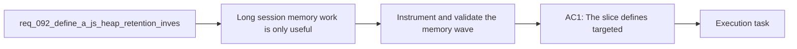

## item_341_define_instrumentation_and_validation_for_long_session_js_heap_retention_reduction - Define instrumentation and validation for long-session JS heap retention reduction
> From version: 0.6.0
> Schema version: 1.0
> Status: Ready
> Understanding: 100%
> Confidence: 96%
> Progress: 0%
> Complexity: Medium
> Theme: Runtime
> Reminder: Update status/understanding/confidence/progress and linked task references when you edit this doc.

# Problem
- Long-session memory work is only useful if the repo can prove what changed between profiling waves.
- The current profiling posture already captures heap snapshots and runtime summaries, but the next wave needs more targeted counters and clearer acceptance evidence.
- Without explicit instrumentation and validation, a lower or higher heap run could still be ambiguous because live runtime counts, cache sizes, and overlay pressure would remain under-explained.
- This backlog item exists to make the memory-reduction wave measurable and repeatable.

# Scope
- In:
- Add targeted runtime instrumentation that helps correlate heap growth with concrete live counts, cache sizes, or overlay pressure.
- Define a repeatable validation posture for rerunning long sessions after the attribution and reduction slices.
- Require evidence that the old profiler stall signal remains gone while the remaining heap signal is reduced or more clearly explained.
- Capture artifacts and summary notes in a way that makes before/after comparison practical.
- Out:
- Replacing the existing long-session harness with a new profiling framework.
- Broad product analytics or telemetry unrelated to runtime memory profiling.
- Performance work that is not required to interpret the heap-retention wave.

# Acceptance criteria
- AC1: The slice defines targeted instrumentation strong enough to correlate total heap growth with concrete runtime counts or cache sizes relevant to the suspected hotspots.
- AC2: The slice defines a repeatable validation matrix that reruns the long-session profiler after the reduction wave, including at minimum the pendulum scenario and one reduced-pressure comparison scenario.
- AC3: The slice defines that validation must confirm both:
- the profiler no longer shows the old stall pattern
- the remaining heap signal is materially reduced or explained more precisely than before
- AC4: The slice defines that the resulting artifacts and summaries remain easy to compare across profiling waves.
- AC5: The slice stays focused on measurement and validation rather than reopening broad implementation work.

# AC Traceability
- AC1 -> Scope: targeted instrumentation must tie heap growth to concrete runtime counters. Proof target: profiling bridge, runtime summaries, and task report evidence.
- AC2 -> Scope: validation must rerun the profiler on the main scenario and a reduced-pressure comparison scenario. Proof target: captured profiling artifacts and task report.
- AC3 -> Scope: the validation posture must prove stall removal and interpret the remaining heap signal. Proof target: runtime summary fields and profiling comparison notes.
- AC4 -> Scope: artifacts must remain comparable across waves. Proof target: saved JSON summaries, heap snapshots, and linked notes.
- AC5 -> Scope: this backlog item is intentionally measurement-focused. Proof target: changed surface stays bounded to profiling, instrumentation, and validation support.

# Decision framing
- Product framing: Not needed
- Product signals: (none detected)
- Product follow-up: No product brief follow-up is expected based on current signals.
- Architecture framing: Not needed
- Architecture signals: (none detected)
- Architecture follow-up: No architecture decision follow-up is expected based on current signals.

# Links
- Product brief(s): (none yet)
- Architecture decision(s): (none yet)
- Request: `req_092_define_a_js_heap_retention_investigation_and_reduction_wave_for_long_runtime_profiling_sessions`
- Primary task(s): `task_064_orchestrate_long_session_js_heap_retention_investigation_and_reduction`

# AI Context
- Summary: Define the instrumentation and validation slice that makes the JS heap-retention wave measurable across profiling runs.
- Keywords: instrumentation, validation, profiling, heap, runtime metrics, counters, artifacts, comparison
- Use when: Use when implementing or reviewing the measurement slice for long-session JS heap retention reduction.
- Skip when: Skip when the change is unrelated to this delivery slice or its linked request.

# Priority
- Impact: High
- Urgency: Medium

# Notes
- Derived from request `req_092_define_a_js_heap_retention_investigation_and_reduction_wave_for_long_runtime_profiling_sessions`.
- This slice should close the loop on the attribution and reduction work by proving what changed.
