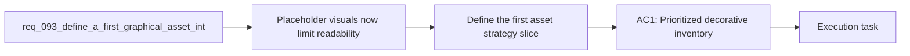

## item_342_define_a_first_graphical_asset_integration_strategy_for_runtime_and_shell_surfaces - Define a first graphical asset integration strategy for runtime and shell surfaces
> From version: 0.6.1
> Schema version: 1.0
> Status: Done
> Understanding: 99%
> Confidence: 96%
> Progress: 100%
> Complexity: High
> Theme: UI
> Reminder: Update status/understanding/confidence/progress and linked task references when you edit this doc.

# Problem
- Emberwake now has enough systems, pickups, hostiles, shell surfaces, and codex/progression affordances that placeholder-first visuals are starting to cap both readability and identity.
- The repo already contains an embryonic asset pipeline through `src/assets/assetCatalog.ts` and `src/shared/config/assetPipeline.ts`, but the playable surfaces still rely heavily on procedural Pixi `Graphics` and inline SVG icon code.
- Without a clear first integration strategy, future art work will likely fragment across runtime, shell, and content layers, producing inconsistent visual language, weak fallback behavior, and unnecessary performance risk.
- This backlog item exists to turn the broad need into one bounded strategy slice that defines what gets decorated first, how assets should be owned, and how the first implementation wave should be validated.

# Scope
- In:
- Inventory the decorative targets that matter most now, grouped into:
- runtime readability surfaces
- system identity surfaces
- shell ambiance surfaces
- Define the first delivery wave as a bounded runtime readability pack rather than a full art pass.
- Define the ownership posture for authored assets across `entities`, `map`, `overlays`, and the shell-facing surfaces that will need their own catalog or adjacent domain.
- Define the default drop-in workflow so most listed assets can be integrated by depositing correctly named files into the expected domain folders.
- Define how authored assets should coexist with procedural visuals, including placeholder-first fallback rules and explicit retention of procedural telegraphs, diagnostics, and cheap overlays where appropriate.
- Define when sidecar metadata or manifest entries are truly required instead of mandatory for every asset.
- Define the expected loading and budget posture so runtime art can grow without regressing startup, activation, or long-session stability.
- Out:
- Producing the full graphical asset library.
- Replacing all current procedural render paths.
- Locking in a final animation toolchain beyond what the first wave strictly needs.
- Taking on a full environment art pass or full codex illustration pass in the same slice.
- Broad brand exploration detached from gameplay and shipping constraints.

# Acceptance criteria
- AC1: The slice defines a prioritized inventory of decorative targets across runtime readability, system identity, and shell ambiance rather than treating assets as one flat backlog.
- AC2: The slice defines the first delivery wave as a gameplay-readability pack including at minimum:
- player presentation
- core hostile families
- pickups
- projectiles or impact feedback
- critical obstacle or terrain readability
- AC3: The slice defines a content-driven ownership strategy in which gameplay and shell visuals resolve through shared asset identifiers, catalog metadata, or a closely related manifest layer rather than scattered direct imports.
- AC4: The slice defines a default drop-in asset workflow with:
- canonical asset ids
- predictable domain folders
- deterministic file naming
- metadata only for exceptional cases
- AC5: The slice defines a fallback posture that preserves current placeholders and selected procedural visuals while authored assets are rolled in gradually.
- AC6: The slice defines a loading and budget posture that protects current shell startup, runtime activation, and long-session performance constraints.
- AC7: The slice links a product brief and an architecture decision that together explain:
- why the first wave should prioritize readability before ambiance
- how runtime, shell, and fallback assets should be integrated
- how the drop-in asset workflow should work by default
- AC8: The slice stays planning-oriented and does not pretend the first strategy wave also completes the final art production pass.

# AC Traceability
- AC1 -> Scope: the work must inventory the decorative targets in meaningful groups. Proof target: request, backlog, and companion docs inventory sections.
- AC2 -> Scope: the first wave must remain a bounded readability pack. Proof target: product brief and task plan wave definition.
- AC3 -> Scope: ownership must stay content-driven. Proof target: ADR decision and follow-up work.
- AC4 -> Scope: the common path should support drop-in file delivery. Proof target: ADR decision and rollout contract.
- AC5 -> Scope: placeholders and procedural fallbacks must remain viable. Proof target: ADR consequences and rollout plan.
- AC6 -> Scope: visual work must preserve budgets. Proof target: task validation plan and ADR loading posture.
- AC7 -> Scope: both product and architecture framing are required before deep implementation. Proof target: linked `prod_017` and `adr_052`.
- AC8 -> Scope: this slice is still strategy-first. Proof target: explicit out-of-scope statements and task boundaries.

# Decision framing
- Product framing: Required
- Product signals: gameplay readability, shell identity, visual prioritization, operator-friendly asset drop workflow
- Product follow-up: Link the agreed product brief before implementation deepens so the first wave remains readability-first and bounded.
- Architecture framing: Required
- Architecture signals: asset ownership, contracts, loading, fallbacks, runtime and shell integration
- Architecture follow-up: Link the asset pipeline ADR before irreversible implementation work starts.

# Links
- Product brief(s): `prod_017_graphical_asset_direction_for_runtime_readability_and_shell_identity`
- Architecture decision(s): `adr_052_adopt_a_content_driven_graphical_asset_pipeline_for_runtime_and_shell_surfaces`
- Request: `req_093_define_a_first_graphical_asset_integration_strategy_for_runtime_and_shell_surfaces`
- Primary task(s): `task_065_orchestrate_the_first_graphical_asset_integration_strategy_and_delivery_plan`

# AI Context
- Summary: Define the bounded strategy slice that turns Emberwake graphical asset integration into a prioritized, performance-safe, content-driven delivery plan.
- Keywords: asset catalog, runtime readability, shell identity, fallback, loading, pixi, vector, raster, prioritization
- Use when: Use when planning or reviewing the first Emberwake asset-integration wave and its companion decisions.
- Skip when: Skip when the work targets another feature, repository, or workflow stage.

# References
- `src/assets/README.md`
- `src/assets/assetCatalog.ts`
- `src/shared/config/assetPipeline.ts`
- `src/game/entities/render/EntityScene.tsx`
- `src/game/world/render/WorldScene.tsx`
- `src/app/components/SkillIcon.tsx`

# Priority
- Impact: High
- Urgency: Medium

# Notes
- Derived from request `req_093_define_a_first_graphical_asset_integration_strategy_for_runtime_and_shell_surfaces`.
- Source file: `logics/request/req_093_define_a_first_graphical_asset_integration_strategy_for_runtime_and_shell_surfaces.md`.
- Request context seeded into this backlog item from `logics/request/req_093_define_a_first_graphical_asset_integration_strategy_for_runtime_and_shell_surfaces.md`.
- Completed by `task_065_orchestrate_the_first_graphical_asset_integration_strategy_and_delivery_plan`.
- Delivery evidence includes `src/assets/assetResolver.ts`, first-wave runtime and shell asset files under `src/assets/**/runtime/`, and bounded scene integration in `src/game/entities/render/EntityScene.tsx`, `src/game/world/render/WorldScene.tsx`, and `src/app/components/CodexArchiveScene.tsx`.
