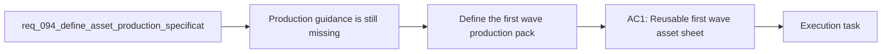

## item_343_define_asset_production_specifications_and_prompt_packs_for_the_first_graphical_wave - Define asset production specifications and prompt packs for the first graphical wave
> From version: 0.6.1
> Schema version: 1.0
> Status: Ready
> Understanding: 99%
> Confidence: 97%
> Progress: 0%
> Complexity: Medium
> Theme: UI
> Reminder: Update status/understanding/confidence/progress and linked task references when you edit this doc.

# Problem
- The asset pipeline direction is now clear, but the team still lacks the production-grade specification needed to actually create and drop usable first-wave assets.
- Today, a future asset creator would still have to guess the right format, transparency rules, source size, framing, and prompt wording for each asset.
- That gap is risky because a visually strong asset can still be unusable if it has the wrong canvas size, the wrong background treatment, or the wrong silhouette posture for the runtime.
- This backlog item exists to turn the first-wave asset list into a production pack that operators can execute directly, whether they use AI generation, human illustration, or a hybrid workflow.

# Scope
- In:
- Define the reusable template for a first-wave asset production entry.
- Define the minimum technical fields required for each asset, including file format, transparency, source size, and destination path.
- Define a first-wave style guide and prompt posture aligned with Emberwake's readability-first techno-shinobi direction.
- Generate copy-paste prompt packs for the first-wave assets.
- Keep the production pack aligned with the drop-in pipeline contract already documented in the repo.
- Out:
- Producing all final files in this backlog item.
- Selecting one mandatory external model or art tool.
- Defining later-wave production packs before the first-wave pack is coherent.
- Replacing the existing strategic asset pipeline docs.

# Acceptance criteria
- AC1: The slice defines a reusable first-wave asset production entry format that can be applied to each asset in the wave.
- AC2: The slice defines the minimum technical fields required for each entry, including:
- `assetId`
- role and target surface
- preferred file format
- transparency expectation
- recommended source resolution
- composition guidance
- destination runtime path
- AC3: The slice defines a first-wave style guide and prompt posture aligned with Emberwake's readability-first techno-shinobi visual direction.
- AC4: The slice defines copy-paste prompts for the first-wave assets rather than only generic style notes.
- AC5: The slice keeps the output compatible with the drop-in asset pipeline and explicitly notes when sidecar metadata is required.
- AC6: The slice stays focused on first-wave production specification and promptability rather than widening into later waves or final art creation.

# AC Traceability
- AC1 -> Scope: the work must create a reusable production-sheet format. Proof target: the generated asset production template.
- AC2 -> Scope: each asset entry must contain the key technical requirements. Proof target: filled first-wave asset sheets.
- AC3 -> Scope: style and prompts must stay coherent with the existing product direction. Proof target: style guide section and prompt pack.
- AC4 -> Scope: prompts must be directly usable by operators. Proof target: copy-paste prompt entries.
- AC5 -> Scope: the production pack must remain pipeline-compatible. Proof target: destination paths and sidecar guidance aligned with the ADR and asset README.
- AC6 -> Scope: this slice remains first-wave-only and guidance-oriented. Proof target: bounded scope and explicit out-of-scope statements.

# Decision framing
- Product framing: Required
- Product signals: style coherence, prompt posture, readability-first art guidance
- Product follow-up: Reuse and keep `prod_017` aligned if the style guide or wave order changes materially.
- Architecture framing: Required
- Architecture signals: asset file contract, sidecar metadata, pipeline compatibility
- Architecture follow-up: Reuse and keep `adr_052` aligned if production guidance reveals new contract needs.

# Links
- Product brief(s): `prod_017_graphical_asset_direction_for_runtime_readability_and_shell_identity`
- Architecture decision(s): `adr_052_adopt_a_content_driven_graphical_asset_pipeline_for_runtime_and_shell_surfaces`
- Request: `req_094_define_asset_production_specifications_and_prompt_packs_for_the_first_graphical_wave`
- Primary task(s): `task_066_orchestrate_first_wave_asset_production_specifications_and_prompt_packs`

# AI Context
- Summary: Define the first-wave production-specification pack that tells Emberwake operators exactly what to generate and how to generate it.
- Keywords: asset sheet, production spec, prompt pack, transparency, format, resolution, style guide, first wave
- Use when: Use when planning or reviewing the first-wave asset production guidance for Emberwake.
- Skip when: Skip when the work targets another feature, repository, or workflow stage.

# References
- `logics/request/req_093_define_a_first_graphical_asset_integration_strategy_for_runtime_and_shell_surfaces.md`
- `logics/backlog/item_342_define_a_first_graphical_asset_integration_strategy_for_runtime_and_shell_surfaces.md`
- `logics/tasks/task_065_orchestrate_the_first_graphical_asset_integration_strategy_and_delivery_plan.md`
- `logics/product/prod_017_graphical_asset_direction_for_runtime_readability_and_shell_identity.md`
- `logics/architecture/adr_052_adopt_a_content_driven_graphical_asset_pipeline_for_runtime_and_shell_surfaces.md`
- `src/assets/README.md`
- `src/shared/config/assetPipeline.ts`

# Priority
- Impact: High
- Urgency: Medium

# Notes
- Derived from request `req_094_define_asset_production_specifications_and_prompt_packs_for_the_first_graphical_wave`.
- Source file: `logics/request/req_094_define_asset_production_specifications_and_prompt_packs_for_the_first_graphical_wave.md`.
- Request context seeded into this backlog item from `logics/request/req_094_define_asset_production_specifications_and_prompt_packs_for_the_first_graphical_wave.md`.
