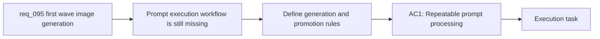

## item_344_define_a_repeatable_first_wave_image_generation_and_asset_promotion_workflow - Define a repeatable first-wave image-generation and asset-promotion workflow
> From version: 0.6.1
> Schema version: 1.0
> Status: Ready
> Understanding: 95%
> Confidence: 92%
> Progress: 0%
> Complexity: Medium
> Theme: UI
> Reminder: Update status/understanding/confidence/progress and linked task references when you edit this doc.

# Problem
- The first-wave prompt pack now exists, but there is still no reliable operator workflow for turning those prompts into a manageable stream of candidate images.
- Without a defined generation and promotion process, operators will run prompts inconsistently, store outputs in ad hoc places, lose the mapping between variants and `assetId`, and make later review or replacement unnecessarily expensive.
- This slice exists to define how first-wave image prompts are executed, where draft outputs live, how variants are compared, and how one approved output is promoted into a final asset candidate for integration.

# Scope
- In:
- define the execution posture for first-wave image generation, including one-off and semi-batch prompt processing
- define where scratch outputs, variant sets, and promoted candidate finals live in the repo
- define naming and traceability rules so each generated file can still be mapped back to one `assetId`
- define promotion rules for selecting a winner among several candidate generations
- keep the workflow reusable for the full first-wave roster rather than one isolated asset
- Out:
- integrating promoted assets into the runtime and shell scenes
- deciding final in-game readability acceptance in combat or shell views
- redesigning prompt content already captured in `spec_001`

# Acceptance criteria
- AC1: The slice defines a repeatable workflow for executing first-wave prompts into candidate image files, including how operators handle one-off runs and multi-variant retries.
- AC2: The slice defines where scratch outputs, reviewable variants, and promoted final candidates should live, with a clear separation between working outputs and runtime asset folders.
- AC3: The slice defines how generated outputs remain traceable to `assetId`, prompt source, and variant index so later review or regeneration does not become guesswork.
- AC4: The slice defines the operator rule for promoting one candidate output into the approved file that will later be integrated into the game.
- AC5: The slice stays bounded to generation and promotion workflow rather than widening into runtime integration or gameplay validation work.

# AC Traceability
- AC1 -> Scope: repeatable prompt execution posture. Proof: documented workflow steps and promotion notes.
- AC2 -> Scope: output ownership and folders. Proof: repo path rules for scratch vs promoted outputs.
- AC3 -> Scope: traceability rules. Proof: asset id and variant mapping guidance.
- AC4 -> Scope: promotion rule. Proof: candidate selection and naming guidance.
- AC5 -> Scope: bounded delivery. Proof: explicit out-of-scope separation from integration work.

# Decision framing
- Product framing: Not needed
- Product signals: style and prompt direction are already covered upstream
- Product follow-up: Reuse `prod_017` and `spec_001` rather than creating another product doc for this operational slice.
- Architecture framing: Required
- Architecture signals: output ownership, asset promotion, naming, and traceability
- Architecture follow-up: Reuse `adr_052` so the generation workflow stays aligned with the existing drop-in asset contract.

# Links
- Product brief(s): `prod_017_graphical_asset_direction_for_runtime_readability_and_shell_identity`
- Architecture decision(s): `adr_052_adopt_a_content_driven_graphical_asset_pipeline_for_runtime_and_shell_surfaces`
- Request: `req_095_process_first_wave_image_generation_prompts_and_integrate_generated_assets_into_the_game`
- Primary task(s): `task_067_orchestrate_first_wave_generated_asset_processing_promotion_and_in_game_integration`

# AI Context
- Summary: Define a repeatable first-wave image-generation and asset-promotion workflow
- Keywords: repeatable, first-wave, image-generation, and, asset-promotion, workflow
- Use when: Use when implementing or reviewing the delivery slice for Define a repeatable first-wave image-generation and asset-promotion workflow.
- Skip when: Skip when the change is unrelated to this delivery slice or its linked request.

# References
- `logics/specs/spec_001_define_first_wave_asset_production_pack.md`
- `output/imagegen/`
- `src/assets/README.md`

# Priority
- Impact: High
- Urgency: Medium

# Notes
- Split from `req_095_process_first_wave_image_generation_prompts_and_integrate_generated_assets_into_the_game`.
- This slice intentionally stops before in-game promotion acceptance; that follow-up lives in `item_345_define_first_wave_generated_asset_integration_and_in_game_readability_validation`.
