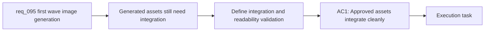

## item_345_define_first_wave_generated_asset_integration_and_in_game_readability_validation - Define first-wave generated-asset integration and in-game readability validation
> From version: 0.6.1
> Schema version: 1.0
> Status: Ready
> Understanding: 95%
> Confidence: 91%
> Progress: 0%
> Complexity: High
> Theme: UI
> Reminder: Update status/understanding/confidence/progress and linked task references when you edit this doc.

# Problem
- Generated images are not useful on their own unless the approved files are actually deposited into the runtime folders, resolved by `assetId`, and reviewed in the real game.
- A visually impressive image can still fail once scaled into combat if its silhouette, directionality, or category cues are weak, so integration and in-game readability review need their own delivery slice.
- This backlog item exists to define how promoted generated assets are integrated into the game, how readability is reviewed on runtime and shell surfaces, and how fallback or overlay rules are preserved when a generated output is not yet strong enough.

# Scope
- In:
- define the integration posture for approved first-wave generated assets under the existing runtime folders and `assetId` contract
- define how runtime and bounded shell surfaces should be reviewed once generated files replace placeholders
- define the readability checks that matter in practice: silhouette recognition, orientation cues, pickup category recognition, terrain identity, and shell banner legibility
- define when a generated asset is accepted, iterated, or rejected in favor of fallback visuals
- keep validation aligned with the existing performance and fallback guardrails
- Out:
- redefining the upstream prompt pack or generation workflow
- widening into later asset waves beyond the first-wave roster
- removing fallback overlays just because a generated file exists

# Acceptance criteria
- AC1: The slice defines how approved first-wave generated assets are promoted into the existing `src/assets/.../runtime/` folders without breaking the shared `assetId` resolution contract.
- AC2: The slice defines the in-game readability checks required before a generated asset is considered acceptable, including directionality when relevant and category recognition for pickups and hostiles.
- AC3: The slice defines how shell-facing generated assets such as the codex banner are reviewed for legibility and bounded identity value rather than treated as free-floating illustrations.
- AC4: The slice defines when existing procedural overlays or placeholder fallbacks remain necessary even after a generated file exists.
- AC5: The slice keeps validation aligned with current performance and smoke guardrails rather than treating visual replacement as exempt from runtime constraints.
- AC6: The slice stays bounded to first-wave generated-asset integration and review rather than widening into later-wave art production.

# AC Traceability
- AC1 -> Scope: integration under the existing runtime folders. Proof: drop-in promotion and runtime-contract notes.
- AC2 -> Scope: gameplay readability review. Proof: explicit review checklist for runtime entities, pickups, and terrain.
- AC3 -> Scope: shell review. Proof: bounded shell-identity validation guidance.
- AC4 -> Scope: fallback preservation. Proof: explicit accept/reject and fallback rules.
- AC5 -> Scope: validation posture. Proof: runtime and smoke/perf guardrails.
- AC6 -> Scope: bounded slice. Proof: out-of-scope statements and first-wave-only target.

# Decision framing
- Product framing: Required
- Product signals: readability, recognition, shell legibility, bounded visual acceptance
- Product follow-up: Reuse `prod_017` so acceptance stays readability-first instead of drifting into aesthetics-only review.
- Architecture framing: Required
- Architecture signals: contracts and integration
- Architecture follow-up: Reuse `adr_052` so generated assets stay inside the drop-in pipeline and fallback contract.

# Links
- Product brief(s): `prod_017_graphical_asset_direction_for_runtime_readability_and_shell_identity`
- Architecture decision(s): `adr_052_adopt_a_content_driven_graphical_asset_pipeline_for_runtime_and_shell_surfaces`
- Request: `req_095_process_first_wave_image_generation_prompts_and_integrate_generated_assets_into_the_game`
- Primary task(s): `task_067_orchestrate_first_wave_generated_asset_processing_promotion_and_in_game_integration`

# AI Context
- Summary: Define first-wave generated-asset integration and in-game readability validation
- Keywords: first-wave, generated-asset, integration, and, in-game, readability, validation
- Use when: Use when implementing or reviewing the delivery slice for Define first-wave generated-asset integration and in-game readability validation.
- Skip when: Skip when the change is unrelated to this delivery slice or its linked request.

# References
- `logics/specs/spec_001_define_first_wave_asset_production_pack.md`
- `src/assets/assetCatalog.ts`
- `src/assets/assetResolver.ts`
- `src/game/entities/render/EntityScene.tsx`
- `src/game/world/render/WorldScene.tsx`
- `src/app/components/CodexArchiveScene.tsx`

# Priority
- Impact: High
- Urgency: Medium

# Notes
- Split from `req_095_process_first_wave_image_generation_prompts_and_integrate_generated_assets_into_the_game`.
- This slice assumes candidate outputs have already been produced and curated by `item_344_define_a_repeatable_first_wave_image_generation_and_asset_promotion_workflow`.
