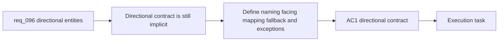

## item_346_define_directional_entity_asset_contract_and_runtime_facing_resolution - Define directional entity asset contract and runtime facing resolution
> From version: 0.6.1
> Schema version: 1.0
> Status: Ready
> Understanding: 97%
> Confidence: 94%
> Progress: 0%
> Complexity: High
> Theme: UI
> Reminder: Update status/understanding/confidence/progress and linked task references when you edit this doc.

# Problem
- `req_096` now makes the directionality goal explicit, but the repo still lacks a concrete delivery slice for how directional entity assets are named, resolved, and selected at runtime.
- Without a bounded contract, the project could drift into ad hoc per-entity rules, unstable orientation thresholds, or unclear fallback behavior when one or more facings are missing.
- This slice exists to define the living-entity directional contract itself: default facing, naming, runtime quadrant resolution, fallback ordering, and the reviewed exception posture for families such as `needle`.

# Scope
- In:
- define `right` as the default authored facing for living entities
- define the directional naming and file-contract shape for `right`, `left`, `up`, and `down`
- define the runtime orientation-to-facing resolution posture
- define fallback ordering when directional assets are missing
- define the first reviewed four-facing roster versus reviewed single-face exceptions
- Out:
- prompt-writing details for generating directional image sets
- batch image-generation workflow or candidate curation
- dark-on-dark readability treatments such as outline or rim light

# Acceptance criteria
- AC1: The slice defines the directional asset contract for living entities, with `right` as the default authored facing and explicit directional variants for `left`, `up`, and `down`.
- AC2: The slice defines a deterministic naming or file-layout rule that keeps directional variants traceable to the base entity asset identity.
- AC3: The slice defines a bounded runtime orientation-to-facing mapping that avoids arbitrary rotation of asymmetric illustrated entities.
- AC4: The slice defines explicit fallback ordering for missing directional variants, including reviewed reuse cases and reviewed rotation-safe exceptions.
- AC5: The slice defines a provisional first-wave living-entity roster that distinguishes four-facing targets from reviewed single-face exceptions such as `entity.hostile.needle.runtime`.

# AC Traceability
- AC1 -> Scope: directional contract. Proof: explicit default facing and directional variant rules.
- AC2 -> Scope: naming and traceability. Proof: documented asset-id or file-stem convention.
- AC3 -> Scope: runtime resolution. Proof: explicit orientation-to-facing posture.
- AC4 -> Scope: fallback ordering. Proof: documented missing-variant behavior.
- AC5 -> Scope: roster and exceptions. Proof: named first-wave targets and named exceptions.

# Decision framing
- Product framing: Required
- Product signals: facing credibility, combat readability, bounded exceptions
- Product follow-up: Reuse `prod_017` so directional asset work stays readability-first.
- Architecture framing: Required
- Architecture signals: asset contract, runtime selection, fallback ordering
- Architecture follow-up: Reuse `adr_051` and `adr_052` so directionality stays aligned with orientation ownership and the drop-in asset pipeline.

# Links
- Product brief(s): `prod_017_graphical_asset_direction_for_runtime_readability_and_shell_identity`
- Architecture decision(s): `adr_051_resolve_player_orientation_through_a_bounded_simulation_owned_turn_rate`, `adr_052_adopt_a_content_driven_graphical_asset_pipeline_for_runtime_and_shell_surfaces`
- Request: `req_096_define_cardinal_directional_runtime_assets_for_player_and_hostile_entities`
- Primary task(s): `task_068_orchestrate_directional_entity_presentation_and_runtime_sprite_separation`

# AI Context
- Summary: Define directional entity asset contract and runtime facing resolution
- Keywords: directional entity assets, right default facing, runtime facing resolution, fallback, needle exception
- Use when: Use when implementing or reviewing the delivery slice for directional entity asset contract and runtime facing resolution.
- Skip when: Skip when the work is about prompt generation only or about non-directional readability treatments.

# References
- `logics/request/req_096_define_cardinal_directional_runtime_assets_for_player_and_hostile_entities.md`
- `src/shared/config/assetPipeline.ts`
- `src/assets/README.md`
- `src/assets/assetResolver.ts`
- `src/game/entities/render/EntityScene.tsx`

# Priority
- Impact: High
- Urgency: Medium

# Notes
- Split from `req_096_define_cardinal_directional_runtime_assets_for_player_and_hostile_entities`.
- This slice intentionally stops before generating directional image sets or implementing contrast-aid treatments.
