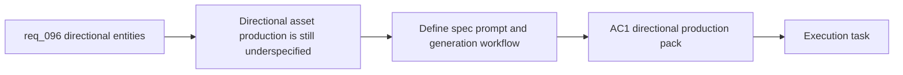

## item_347_define_directional_entity_production_pack_and_generation_workflow - Define directional entity production pack and generation workflow
> From version: 0.6.1
> Schema version: 1.0
> Status: Ready
> Understanding: 96%
> Confidence: 93%
> Progress: 0%
> Complexity: High
> Theme: UI
> Reminder: Update status/understanding/confidence/progress and linked task references when you edit this doc.

# Problem
- Even with a directional contract, the project still needs an operator-ready way to produce, name, generate, and review four-facing entity sets without guesswork.
- Without a bounded production slice, the asset workflow could multiply into inconsistent prompts, missing facings, or untraceable per-facing candidates.
- This slice exists to define how the production pack, prompt posture, and generation workflow should evolve from one entity sprite to a directional set while still supporting reviewed exceptions such as `needle`.

# Scope
- In:
- define how `spec_001` or its successor should express directional entity entries
- define how prompts and generated outputs should be grouped per facing
- define how operators review and promote directional candidate sets
- define how reviewed single-face exceptions are represented in the workflow
- keep the workflow compatible with the existing `output/imagegen` and runtime promotion posture
- Out:
- runtime orientation mapping and directional asset selection logic
- runtime sprite-separation or outline treatments
- broad shell or biome art expansion

# Acceptance criteria
- AC1: The slice defines how directional entity entries are represented in the production pack, including per-facing generation expectations.
- AC2: The slice defines how prompts, candidate files, and promoted outputs stay traceable per facing.
- AC3: The slice defines how operators review a directional set as one bounded unit rather than as unrelated single images.
- AC4: The slice defines how reviewed exceptions such as `needle` remain expressible without forcing a fake four-facing set.
- AC5: The slice stays bounded to production-pack and generation workflow changes rather than widening into runtime integration logic.

# AC Traceability
- AC1 -> Scope: directional production pack. Proof: updated asset-spec shape or equivalent directional guidance.
- AC2 -> Scope: traceable outputs. Proof: documented per-facing candidate naming and promotion guidance.
- AC3 -> Scope: set review posture. Proof: directional review expectations are explicit.
- AC4 -> Scope: reviewed exceptions. Proof: single-face exception workflow is documented.
- AC5 -> Scope: bounded delivery. Proof: runtime integration stays out of scope here.

# Decision framing
- Product framing: Required
- Product signals: directional consistency, readable entity identity, operator clarity
- Product follow-up: Reuse `prod_017` so directional prompt work stays disciplined rather than decorative.
- Architecture framing: Required
- Architecture signals: file ownership, output organization, promotion workflow
- Architecture follow-up: Reuse `adr_052` so directional sets stay inside the existing drop-in pipeline.

# Links
- Product brief(s): `prod_017_graphical_asset_direction_for_runtime_readability_and_shell_identity`
- Architecture decision(s): `adr_052_adopt_a_content_driven_graphical_asset_pipeline_for_runtime_and_shell_surfaces`
- Request: `req_096_define_cardinal_directional_runtime_assets_for_player_and_hostile_entities`
- Primary task(s): `task_068_orchestrate_directional_entity_presentation_and_runtime_sprite_separation`

# AI Context
- Summary: Define directional entity production pack and generation workflow
- Keywords: directional prompt pack, four-facing entity generation, candidate review, needle exception
- Use when: Use when implementing or reviewing the production and generation slice for directional living entities.
- Skip when: Skip when the work is about runtime facing resolution or contrast-aid rendering.

# References
- `logics/request/req_096_define_cardinal_directional_runtime_assets_for_player_and_hostile_entities.md`
- `logics/specs/spec_001_define_first_wave_asset_production_pack.md`
- `scripts/assets/firstWaveAssetWorkflow.mjs`
- `scripts/assets/generateFirstWaveAssets.mjs`
- `scripts/assets/promoteFirstWaveAssets.mjs`

# Priority
- Impact: High
- Urgency: Medium

# Notes
- Split from `req_096_define_cardinal_directional_runtime_assets_for_player_and_hostile_entities`.
- This slice intentionally stops before runtime-facing resolution and before dark-on-dark sprite separation work.
