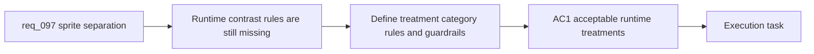

## item_348_define_runtime_sprite_separation_rules_for_entities_and_pickups_on_dark_biomes - Define runtime sprite separation rules for entities and pickups on dark biomes
> From version: 0.6.1
> Schema version: 1.0
> Status: Done
> Understanding: 97%
> Confidence: 94%
> Progress: 100%
> Complexity: Medium
> Theme: UI
> Reminder: Update status/understanding/confidence/progress and linked task references when you edit this doc.

# Problem
- `req_097` now frames the dark-on-dark readability issue, but the repo still lacks a concrete slice for what the runtime separation treatment actually is and how it differs between player, hostiles, and pickups.
- Without a bounded rule set, readability fixes could drift into noisy halos, inconsistent category treatment, or cheap-looking rectangle-like solutions.
- This slice exists to define the runtime separation posture itself: acceptable techniques, category-specific treatment rules, alpha behavior, and bounded intensity constraints.

# Scope
- In:
- define acceptable runtime-first separation techniques such as alpha-aware outline, rim light, or subtle under-glow
- define how category-specific treatment should differ between player, hostiles, and pickups
- define intensity, thickness, and alpha-threshold guardrails
- define the first-priority pickup surfaces, including crystals, gold, healing kits, magnets, hourglasses, and caches
- Out:
- broad biome recoloring or terrain redesign
- prompt regeneration or source-asset redraw work
- full validation and tuning across all runtime scenes

# Acceptance criteria
- AC1: The slice defines the acceptable runtime-first separation techniques for dark-on-dark gameplay readability.
- AC2: The slice defines how treatment may vary between player, hostiles, and pickups.
- AC3: The slice defines how sprite transparency and alpha thresholds must shape the treatment so it follows the silhouette rather than the texture rectangle.
- AC4: The slice defines bounded intensity or thickness rules so the treatment stays readable without becoming noisy.
- AC5: The slice explicitly includes high-value pickups such as crystals and gold in the covered readability posture.

# AC Traceability
- AC1 -> Scope: acceptable techniques. Proof: explicit outline/rim/under-glow posture.
- AC2 -> Scope: category differentiation. Proof: documented player/hostile/pickup rules.
- AC3 -> Scope: alpha behavior. Proof: explicit silhouette-following requirement.
- AC4 -> Scope: bounded intensity. Proof: guardrails for thickness, glow, or strength.
- AC5 -> Scope: pickups included. Proof: explicit pickup roster coverage.

# Decision framing
- Product framing: Required
- Product signals: gameplay readability, category recognition, visual restraint
- Product follow-up: Reuse `prod_017` so the separation posture serves readability rather than spectacle.
- Architecture framing: Required
- Architecture signals: runtime rendering rule, alpha handling, category behavior
- Architecture follow-up: Reuse `adr_052` so the treatment stays consistent with the asset pipeline and fallback posture.

# Links
- Product brief(s): `prod_017_graphical_asset_direction_for_runtime_readability_and_shell_identity`
- Architecture decision(s): `adr_052_adopt_a_content_driven_graphical_asset_pipeline_for_runtime_and_shell_surfaces`
- Request: `req_097_define_a_runtime_sprite_separation_posture_for_dark_on_dark_asset_readability`
- Primary task(s): `task_068_orchestrate_directional_entity_presentation_and_runtime_sprite_separation`

# AI Context
- Summary: Define runtime sprite separation rules for entities and pickups on dark biomes
- Keywords: alpha outline, rim light, pickup readability, dark biome, player hostile pickup differentiation
- Use when: Use when implementing or reviewing the runtime treatment slice for dark-on-dark gameplay readability.
- Skip when: Skip when the work is primarily about prompt generation or biome re-art direction.

# References
- `logics/request/req_097_define_a_runtime_sprite_separation_posture_for_dark_on_dark_asset_readability.md`
- `src/game/entities/render/EntityScene.tsx`
- `src/assets/useResolvedAssetTexture.ts`
- `src/assets/assetCatalog.ts`

# Priority
- Impact: High
- Urgency: Medium

# Notes
- Split from `req_097_define_a_runtime_sprite_separation_posture_for_dark_on_dark_asset_readability`.
- This slice intentionally stops before the broader validation and tuning pass across darker biomes and dense runtime scenes.
- Delivered in `task_068` with category-specific alpha-aware sprite separation inside `src/game/entities/render/EntityScene.tsx`, covering `player`, `hostile`, and `pickup` silhouettes without rectangle backplates.
