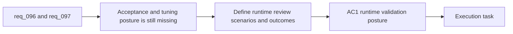

## item_349_define_validation_and_tuning_for_directional_entities_and_dark_on_dark_readability - Define validation and tuning for directional entities and dark-on-dark readability
> From version: 0.6.1
> Schema version: 1.0
> Status: Done
> Understanding: 96%
> Confidence: 93%
> Progress: 100%
> Complexity: Medium
> Theme: UI
> Reminder: Update status/understanding/confidence/progress and linked task references when you edit this doc.

# Problem
- The project now has two related visual requests, but it still needs a bounded slice that defines how success is judged once directional entities and sprite-separation treatments are actually present in the game.
- Without explicit validation and tuning posture, the team could ship technically correct assets and runtime effects that still feel wrong in motion, near diagonals, or on darker biomes.
- This slice exists to define the validation expectations that cover both directionality and contrast-aid readability in one practical runtime review posture.

# Scope
- In:
- define how directional entity presentation should be reviewed in real runtime scenes
- define how dark-on-dark readability should be reviewed for player, hostiles, and pickups
- define which scenarios, biome conditions, or screen states matter most for acceptance
- define how tuning outcomes are recorded when a family is accepted, deferred, or kept on an exception path such as `needle`
- Out:
- defining the base directional asset contract itself
- defining the base runtime outline/rim rules themselves
- broad perf or rendering architecture work outside the covered visual slices

# Acceptance criteria
- AC1: The slice defines a runtime validation posture for directional entity presentation, including facing credibility near key movement directions.
- AC2: The slice defines a runtime validation posture for dark-on-dark readability across player, hostiles, and pickups on darker biomes.
- AC3: The slice defines how reviewed exceptions such as `needle` are validated and recorded.
- AC4: The slice defines what it means for a family or pickup surface to be accepted, tuned further, deferred, or left on fallback.
- AC5: The slice keeps validation aligned with the existing smoke, lint, typecheck, and test posture rather than treating this visual wave as validation-exempt.

# AC Traceability
- AC1 -> Scope: directional validation. Proof: explicit runtime facing review posture.
- AC2 -> Scope: readability validation. Proof: explicit dark-biome review posture.
- AC3 -> Scope: reviewed exceptions. Proof: documented acceptance posture for exception families.
- AC4 -> Scope: tuning outcomes. Proof: explicit accept/tune/defer/fallback recording rules.
- AC5 -> Scope: validation alignment. Proof: existing project validation posture remains referenced.

# Decision framing
- Product framing: Required
- Product signals: readability, credibility in motion, bounded acceptance
- Product follow-up: Reuse `prod_017` so validation stays gameplay-first.
- Architecture framing: Not needed
- Architecture signals: runtime rules are covered upstream; this slice focuses on review posture
- Architecture follow-up: Reuse the upstream request and backlog context instead of creating a new ADR.

# Links
- Product brief(s): `prod_017_graphical_asset_direction_for_runtime_readability_and_shell_identity`
- Request: `req_096_define_cardinal_directional_runtime_assets_for_player_and_hostile_entities`, `req_097_define_a_runtime_sprite_separation_posture_for_dark_on_dark_asset_readability`
- Primary task(s): `task_068_orchestrate_directional_entity_presentation_and_runtime_sprite_separation`

# AI Context
- Summary: Define validation and tuning for directional entities and dark-on-dark readability
- Keywords: validation, tuning, directional entities, needle exception, dark biome readability, pickup visibility
- Use when: Use when implementing or reviewing the acceptance posture for the directional and sprite-separation wave.
- Skip when: Skip when the work is still defining the base contracts or runtime rules.

# References
- `logics/request/req_096_define_cardinal_directional_runtime_assets_for_player_and_hostile_entities.md`
- `logics/request/req_097_define_a_runtime_sprite_separation_posture_for_dark_on_dark_asset_readability.md`
- `src/game/entities/render/EntityScene.tsx`
- `src/game/world/render/WorldScene.tsx`
- `scripts/testing/runBrowserSmoke.mjs`

# Priority
- Impact: High
- Urgency: Medium

# Notes
- Split jointly from `req_096_define_cardinal_directional_runtime_assets_for_player_and_hostile_entities` and `req_097_define_a_runtime_sprite_separation_posture_for_dark_on_dark_asset_readability`.
- This slice exists to keep the later orchestration task honest about what “good enough” means in-game.
- Delivered in `task_068` through runtime browser review on the live scene, targeted helper tests, full project validation, and explicit acceptance of `needle` as the reviewed single-face rotating exception.
