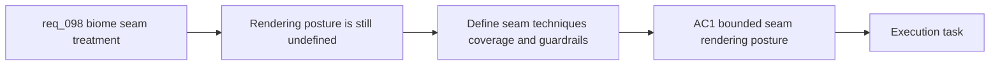

## item_350_define_biome_transition_seam_rendering_posture_and_asset_coverage - Define biome transition seam rendering posture and asset coverage
> From version: 0.6.1
> Schema version: 1.0
> Status: Done
> Understanding: 98%
> Confidence: 99%
> Progress: 100%
> Complexity: Medium
> Theme: UI
> Reminder: Update status/understanding/confidence/progress and linked task references when you edit this doc.

# Problem
- `req_098` frames the need, but the repo still lacks a concrete slice for what the first biome seam treatment actually is at the rendering and asset level.
- Without a bounded rendering posture, the implementation could drift into generic fades, too many bespoke pair assets, or a premature terrain-mixing system.
- This slice exists to define the seam-treatment contract itself: acceptable visual techniques, where seam assets live, how wide or irregular the treatment may be, and which seam families get first-class coverage in wave one.

# Scope
- In:
- define the first acceptable seam-treatment posture, such as irregular overlays, contamination strips, fracture masks, or bounded hybrid props
- define the visual language and restraint rules for seam width, edge irregularity, and local noise
- define how seam treatments map onto the existing terrain asset pipeline and runtime world rendering posture
- define the first biome-pair or seam-family coverage for wave one
- define fallback expectations when a specific seam treatment is not authored
- Out:
- broad validation/tuning across all runtime scenes
- a full procedural terrain-blending engine
- repainting every biome surface before seam work begins
- broader world-art direction work outside seam treatment

# Acceptance criteria
- AC1: The slice defines the bounded first-line seam-rendering techniques allowed for wave one.
- AC2: The slice defines width, irregularity, and restraint guardrails so seams feel organic without becoming muddy or noisy.
- AC3: The slice defines how seam-treatment assets or overlays fit into the current terrain asset pipeline and runtime render path.
- AC4: The slice defines which biome seam families or biome pairs receive authored treatment first.
- AC5: The slice preserves gameplay readability by constraining seam contrast and visual competition around entities, pickups, and telegraphs.
- AC6: The slice defines a fallback posture for seams that do not yet have bespoke treatment.

# AC Traceability
- AC1 -> Scope: acceptable seam techniques. Proof: explicit overlay/strip/mask posture in scope.
- AC2 -> Scope: bounded visual rules. Proof: explicit width/irregularity/restraint guardrails in scope.
- AC3 -> Scope: pipeline compatibility. Proof: explicit runtime asset/render-path fit in scope.
- AC4 -> Scope: first coverage map. Proof: explicit first biome-pair or seam-family coverage in scope.
- AC5 -> Scope: readability preservation. Proof: explicit combat and pickup readability constraint in scope.
- AC6 -> Scope: fallback posture. Proof: explicit non-bespoke seam fallback requirement in scope.

# Decision framing
- Product framing: Not needed
- Product signals: (none detected)
- Product follow-up: No product brief follow-up is expected based on current signals.
- Architecture framing: Required
- Architecture signals: data model and persistence, runtime and boundaries, delivery and operations
- Architecture follow-up: Create or link an architecture decision before irreversible implementation work starts.

# Links
- Product brief(s): `prod_017_graphical_asset_direction_for_runtime_readability_and_shell_identity`
- Architecture decision(s): `adr_052_adopt_a_content_driven_graphical_asset_pipeline_for_runtime_and_shell_surfaces`
- Request: `req_098_define_a_bounded_biome_transition_visual_treatment_to_reduce_hard_map_seams`
- Primary task(s): `task_069_orchestrate_biome_seam_settings_shell_and_pickup_sizing_polish`

# AI Context
- Summary: Define a bounded first-wave visual treatment to reduce abrupt biome seams in the runtime world.
- Keywords: biome transitions, seam overlay, contamination, fracture, terrain cohesion, transition strip, readability
- Use when: Use when framing a focused world-surface polish wave for reducing abrupt biome boundaries.
- Skip when: Skip when the work is about entity sprites, shell theming, or a full terrain engine rewrite.

# References
- `logics/request/req_093_define_a_first_graphical_asset_integration_strategy_for_runtime_and_shell_surfaces.md`
- `logics/request/req_095_process_first_wave_image_generation_prompts_and_integrate_generated_assets_into_the_game.md`
- `logics/request/req_097_define_a_runtime_sprite_separation_posture_for_dark_on_dark_asset_readability.md`
- `logics/product/prod_017_graphical_asset_direction_for_runtime_readability_and_shell_identity.md`
- `logics/architecture/adr_052_adopt_a_content_driven_graphical_asset_pipeline_for_runtime_and_shell_surfaces.md`
- `games/emberwake/src/content/world/worldGeneration.ts`
- `games/emberwake/src/content/world/worldData.ts`
- `src/game/world/render/WorldScene.tsx`
- `logics/skills/logics-ui-steering/SKILL.md`

# Priority
- Impact:
- Urgency:

# Notes
- Derived from request `req_098_define_a_bounded_biome_transition_visual_treatment_to_reduce_hard_map_seams`.
- Source file: `logics/request/req_098_define_a_bounded_biome_transition_visual_treatment_to_reduce_hard_map_seams.md`.
- Request context seeded into this backlog item from `logics/request/req_098_define_a_bounded_biome_transition_visual_treatment_to_reduce_hard_map_seams.md`.
- This slice intentionally focuses on the treatment contract and first asset/runtime coverage, not the broader validation wave.
