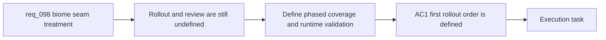

## item_352_define_biome_transition_validation_and_phased_runtime_rollout - Define biome transition validation and phased runtime rollout
> From version: 0.6.1
> Schema version: 1.0
> Status: Ready
> Understanding: 98%
> Confidence: 95%
> Progress: 0%
> Complexity: Medium
> Theme: UI
> Reminder: Update status/understanding/confidence/progress and linked task references when you edit this doc.

# Problem
- Even with a seam-treatment posture defined, the repo still needs a bounded slice for where to apply it first and how to validate that it improves cohesion without harming readability.
- Without an explicit rollout and review slice, implementation could either over-scope into every biome pairing at once or under-validate the most visible seams.
- This slice exists to define phased coverage, runtime review criteria, and tuning expectations for the first biome-transition delivery wave.

# Scope
- In:
- define the first rollout order for seam-heavy biome pairings or seam archetypes
- define what runtime scenes, camera views, or traversal situations must be reviewed
- define readability and cohesion validation checkpoints for the first seam wave
- define tuning expectations when seams look too artificial, too noisy, or too competitive with gameplay surfaces
- define whether the first rollout is pair-specific, seam-archetype-specific, or geography-priority-based
- Out:
- defining the rendering contract itself
- authoring every seam treatment in one backlog slice
- broader world-polish work unrelated to biome transitions

# Acceptance criteria
- AC1: The slice defines the first rollout order or prioritization posture for biome seam coverage.
- AC2: The slice defines the runtime review scenes or situations that must be used to evaluate seam quality.
- AC3: The slice defines bounded validation criteria for visual cohesion and gameplay readability.
- AC4: The slice defines tuning triggers and expected adjustments when seams read as too harsh, too soft, too linear, or too noisy.
- AC5: The slice preserves scope by stopping at phased rollout and validation rather than expanding into a full world-polish program.

# AC Traceability
- AC1 -> Scope: phased rollout. Proof: explicit rollout order or prioritization in scope.
- AC2 -> Scope: runtime review scenes. Proof: explicit review contexts in scope.
- AC3 -> Scope: validation criteria. Proof: explicit cohesion and readability checkpoints in scope.
- AC4 -> Scope: tuning posture. Proof: explicit corrective triggers and adjustments in scope.
- AC5 -> Scope: bounded rollout slice. Proof: explicit exclusions against broader world-polish expansion.

# Decision framing
- Product framing: Not needed
- Product signals: (none detected)
- Product follow-up: No product brief follow-up is expected based on current signals.
- Architecture framing: Required
- Architecture signals: data model and persistence, runtime and boundaries, delivery and operations
- Architecture follow-up: Create or link an architecture decision before irreversible implementation work starts.

# Links
- Product brief(s): `prod_017_graphical_asset_direction_for_runtime_readability_and_shell_identity`
- Architecture decision(s): `adr_052_adopt_a_content_driven_graphical_asset_pipeline_for_runtime_and_shell_surfaces`
- Request: `req_098_define_a_bounded_biome_transition_visual_treatment_to_reduce_hard_map_seams`
- Primary task(s): `task_069_orchestrate_biome_seam_settings_shell_and_pickup_sizing_polish`

# AI Context
- Summary: Define a bounded first-wave visual treatment to reduce abrupt biome seams in the runtime world.
- Keywords: biome transitions, seam overlay, contamination, fracture, terrain cohesion, transition strip, readability
- Use when: Use when framing a focused world-surface polish wave for reducing abrupt biome boundaries.
- Skip when: Skip when the work is about entity sprites, shell theming, or a full terrain engine rewrite.

# References
- `logics/request/req_093_define_a_first_graphical_asset_integration_strategy_for_runtime_and_shell_surfaces.md`
- `logics/request/req_095_process_first_wave_image_generation_prompts_and_integrate_generated_assets_into_the_game.md`
- `logics/request/req_097_define_a_runtime_sprite_separation_posture_for_dark_on_dark_asset_readability.md`
- `logics/product/prod_017_graphical_asset_direction_for_runtime_readability_and_shell_identity.md`
- `logics/architecture/adr_052_adopt_a_content_driven_graphical_asset_pipeline_for_runtime_and_shell_surfaces.md`
- `games/emberwake/src/content/world/worldGeneration.ts`
- `games/emberwake/src/content/world/worldData.ts`
- `src/game/world/render/WorldScene.tsx`
- `logics/skills/logics-ui-steering/SKILL.md`

# Priority
- Impact:
- Urgency:

# Notes
- Derived from request `req_098_define_a_bounded_biome_transition_visual_treatment_to_reduce_hard_map_seams`.
- Source file: `logics/request/req_098_define_a_bounded_biome_transition_visual_treatment_to_reduce_hard_map_seams.md`.
- Request context seeded into this backlog item from `logics/request/req_098_define_a_bounded_biome_transition_visual_treatment_to_reduce_hard_map_seams.md`.
- This slice intentionally assumes the rendering and asset posture is handled elsewhere, then focuses on rollout order and review discipline.
