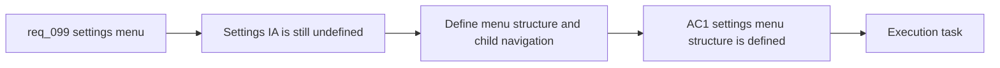

## item_353_define_settings_menu_navigation_and_child_surface_structure - Define settings menu navigation and child surface structure
> From version: 0.6.1
> Schema version: 1.0
> Status: Ready
> Understanding: 98%
> Confidence: 95%
> Progress: 0%
> Complexity: Medium
> Theme: UI
> Reminder: Update status/understanding/confidence/progress and linked task references when you edit this doc.

# Problem
- `req_099` frames the target shell structure, but the repo still lacks a clean delivery slice for turning `Settings` into a category menu with child surfaces.
- Without a dedicated navigation slice, the implementation could mix menu-shell changes, graphics behavior, and desktop calibration logic in one over-broad delivery.
- This slice exists to define the settings information architecture itself: menu entry points, child-surface navigation, large-screen/mobile posture, and back-action coherence.

# Scope
- In:
- define the top-level `Settings` menu structure and entry list
- define the dedicated `Desktop controls` child surface posture
- define how `Graphics` appears as a child surface from the menu level
- define back-navigation, escape behavior, and return paths between settings menu, child surface, shell menu, and main menu
- define the mobile posture for `Desktop controls` availability
- Out:
- the runtime graphics toggle behavior itself
- broader shell-scene refactors beyond the bounded settings flow
- gameplay input rebinding behavior changes

# Acceptance criteria
- AC1: The slice defines the `Settings` menu as a category surface rather than a direct desktop-controls panel.
- AC2: The slice defines the dedicated `Desktop controls` child surface and how it is reached from the settings menu.
- AC3: The slice defines the dedicated `Graphics` child surface as part of the same settings navigation structure.
- AC4: The slice defines coherent back and escape behavior between menu level, child surfaces, and the surrounding shell flow.
- AC5: The slice defines desktop and mobile posture for the settings menu and for `Desktop controls` availability.

# AC Traceability
- AC1 -> Scope: settings menu posture. Proof: explicit category-surface definition in scope.
- AC2 -> Scope: desktop controls child surface. Proof: explicit child-surface routing in scope.
- AC3 -> Scope: graphics child surface. Proof: explicit sibling child-surface definition in scope.
- AC4 -> Scope: navigation coherence. Proof: explicit back and escape behavior in scope.
- AC5 -> Scope: layout posture. Proof: explicit desktop/mobile handling in scope.

# Decision framing
- Product framing: Required
- Product signals: navigation and discoverability, experience scope
- Product follow-up: Create or link a product brief before implementation moves deeper into delivery.
- Architecture framing: Required
- Architecture signals: data model and persistence, delivery and operations
- Architecture follow-up: Create or link an architecture decision before irreversible implementation work starts.

# Links
- Product brief(s): (none yet)
- Architecture decision(s): (none yet)
- Request: `req_099_define_a_settings_menu_with_desktop_controls_and_graphics_subscreens`
- Primary task(s): `task_069_orchestrate_biome_seam_settings_shell_and_pickup_sizing_polish`

# AI Context
- Summary: Define a settings menu with desktop controls and graphics subscreens
- Keywords: settings, menu, graphics, desktop controls, shell navigation, entity circles, runtime presentation
- Use when: Use when framing a bounded settings-navigation and graphics-option slice inside the Emberwake shell.
- Skip when: Skip when the work is about gameplay input logic, deep renderer settings, or debug tooling unrelated to player-facing settings.

# References
- `src/app/components/AppMetaScenePanel.tsx`
- `src/app/components/AppMetaScenePanel.test.tsx`
- `src/app/components/DesktopControlSettingsSection.tsx`
- `src/app/components/ShellMenu.tsx`
- `src/app/hooks/useAppScene.ts`
- `src/app/model/appScene.ts`
- `src/game/entities/render/EntityScene.tsx`
- `logics/skills/logics-ui-steering/SKILL.md`

# Priority
- Impact:
- Urgency:

# Notes
- Derived from request `req_099_define_a_settings_menu_with_desktop_controls_and_graphics_subscreens`.
- Source file: `logics/request/req_099_define_a_settings_menu_with_desktop_controls_and_graphics_subscreens.md`.
- Request context seeded into this backlog item from `logics/request/req_099_define_a_settings_menu_with_desktop_controls_and_graphics_subscreens.md`.
- This slice intentionally stops before the runtime entity-ring toggle behavior itself.
