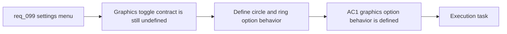

## item_354_define_graphics_settings_toggle_for_runtime_entity_circles_and_rings - Define graphics settings toggle for runtime entity circles and rings
> From version: 0.6.1
> Schema version: 1.0
> Status: Ready
> Understanding: 98%
> Confidence: 95%
> Progress: 0%
> Complexity: Medium
> Theme: UI
> Reminder: Update status/understanding/confidence/progress and linked task references when you edit this doc.

# Problem
- `req_099` frames the new `Graphics` child surface, but the repo still lacks a bounded slice for what the graphics toggle actually governs and how it persists.
- Without a dedicated graphics-options slice, the implementation could blur together navigation work, persistence choices, and runtime entity-presentation behavior.
- This slice exists to define the first graphics setting itself: circle/ring coverage, default state, persistence posture, and how the toggle maps onto runtime entity presentation.

# Scope
- In:
- define the first `Graphics` option for showing or hiding runtime entity circles/rings
- define which entity categories the option affects, such as player, hostiles, pickups, or all supported categories together
- define the default state and persistence posture of the option
- define the bounded wording and operator-facing meaning of the setting so it reads as a graphics preference rather than a raw debug switch
- define the render-path expectation for when the option is disabled
- Out:
- the surrounding settings-menu navigation shell
- a broader graphics options suite
- unrelated runtime entity-presentation redesign beyond circle/ring visibility

# Acceptance criteria
- AC1: The slice defines the first `Graphics` option for showing or hiding runtime entity circles/rings.
- AC2: The slice defines which entity categories are covered by the option.
- AC3: The slice defines the default state and persistence posture of the option.
- AC4: The slice defines the operator-facing label or meaning of the option so it reads as a graphics preference rather than as an implementation detail.
- AC5: The slice defines the bounded runtime behavior expected when circles/rings are disabled.

# AC Traceability
- AC1 -> Scope: graphics option behavior. Proof: explicit show/hide option in scope.
- AC2 -> Scope: entity coverage. Proof: explicit covered categories in scope.
- AC3 -> Scope: persistence posture. Proof: explicit default and persistence definition in scope.
- AC4 -> Scope: operator-facing meaning. Proof: explicit wording requirement in scope.
- AC5 -> Scope: bounded runtime effect. Proof: explicit disabled-state render-path expectation in scope.

# Decision framing
- Product framing: Required
- Product signals: navigation and discoverability, experience scope
- Product follow-up: Create or link a product brief before implementation moves deeper into delivery.
- Architecture framing: Required
- Architecture signals: data model and persistence, delivery and operations
- Architecture follow-up: Create or link an architecture decision before irreversible implementation work starts.

# Links
- Product brief(s): (none yet)
- Architecture decision(s): (none yet)
- Request: `req_099_define_a_settings_menu_with_desktop_controls_and_graphics_subscreens`
- Primary task(s): `task_069_orchestrate_biome_seam_settings_shell_and_pickup_sizing_polish`

# AI Context
- Summary: Define a settings menu with desktop controls and graphics subscreens
- Keywords: settings, menu, graphics, desktop controls, shell navigation, entity circles, runtime presentation
- Use when: Use when framing a bounded settings-navigation and graphics-option slice inside the Emberwake shell.
- Skip when: Skip when the work is about gameplay input logic, deep renderer settings, or debug tooling unrelated to player-facing settings.

# References
- `src/app/components/AppMetaScenePanel.tsx`
- `src/app/components/AppMetaScenePanel.test.tsx`
- `src/app/components/DesktopControlSettingsSection.tsx`
- `src/app/components/ShellMenu.tsx`
- `src/app/hooks/useAppScene.ts`
- `src/app/model/appScene.ts`
- `src/game/entities/render/EntityScene.tsx`
- `logics/skills/logics-ui-steering/SKILL.md`

# Priority
- Impact:
- Urgency:

# Notes
- Derived from request `req_099_define_a_settings_menu_with_desktop_controls_and_graphics_subscreens`.
- Source file: `logics/request/req_099_define_a_settings_menu_with_desktop_controls_and_graphics_subscreens.md`.
- Request context seeded into this backlog item from `logics/request/req_099_define_a_settings_menu_with_desktop_controls_and_graphics_subscreens.md`.
- This slice intentionally assumes the settings shell exists and focuses on the actual graphics preference contract.
