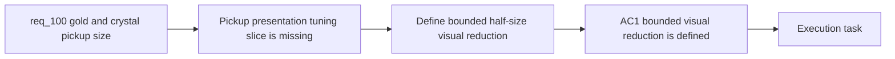

## item_355_reduce_gold_and_crystal_pickup_runtime_presentation_size_by_half - Reduce gold and crystal pickup runtime presentation size by half
> From version: 0.6.1
> Schema version: 1.0
> Status: Ready
> Understanding: 99%
> Confidence: 97%
> Progress: 0%
> Complexity: Medium
> Theme: UI
> Reminder: Update status/understanding/confidence/progress and linked task references when you edit this doc.

# Problem
- `req_100` frames the tuning need, but the repo still lacks a bounded delivery slice for reducing `gold` and `crystal` pickup presentation size without touching pickup gameplay behavior.
- Without a dedicated presentation-only slice, implementation could accidentally change collection feel, shared pickup sizing rules, or broader pickup balance.
- This slice exists to define and deliver the visual half-size reduction for `gold` and `crystal`, while preserving readability and keeping the effect isolated from other pickup families.

# Scope
- In:
- reduce the runtime presentation size of `entity.pickup.gold.runtime` and `entity.pickup.crystal.runtime` by 50 percent
- keep the change presentation-only and separate from pickup radius, footprint, spawn logic, and reward values
- define how outline, ring, or separation treatment scales with the smaller pickup visuals
- validate that gold and crystal remain readable and recognizable in live runtime scenes
- Out:
- changes to non-gold, non-crystal pickup families
- changes to pickup gameplay radius or collection behavior
- changes to economy values or spawn rates
- broad pickup-presentation rebalance beyond these two reward pickups

# Acceptance criteria
- AC1: The request defines a bounded visual size reduction of 50 percent for `gold` and `crystal` pickup presentation.
- AC2: The request makes clear that the requested reduction concerns runtime presentation size rather than pickup gameplay radius, footprint, reward value, or spawn logic.
- AC3: The request keeps scope limited to `gold` and `crystal` rather than broadening into a full pickup-size rebalance.
- AC4: The request defines that readability and category recognition must remain acceptable after the size change.
- AC5: The request defines how pickup-specific runtime separation treatment should behave once the pickup visuals are smaller.
- AC6: The request references the real code paths currently responsible for pickup presentation sizing.

# AC Traceability
- AC1 -> Scope: bounded visual reduction. Proof: explicit 50 percent presentation reduction in scope.
- AC2 -> Scope: presentation-only posture. Proof: explicit exclusions for gameplay radius, footprint, value, and spawn tuning.
- AC3 -> Scope: bounded pickup roster. Proof: explicit gold-and-crystal-only scope.
- AC4 -> Scope: readability validation. Proof: explicit runtime readability review in scope.
- AC5 -> Scope: separation treatment scaling. Proof: explicit outline/ring scaling in scope.
- AC6 -> References: real codepath grounding. Proof: explicit render and asset references included below.

# Decision framing
- Product framing: Not needed
- Product signals: (none detected)
- Product follow-up: No product brief follow-up is expected based on current signals.
- Architecture framing: Required
- Architecture signals: data model and persistence, state and sync, delivery and operations
- Architecture follow-up: Create or link an architecture decision before irreversible implementation work starts.

# Links
- Product brief(s): (none yet)
- Architecture decision(s): (none yet)
- Request: `req_100_reduce_gold_and_crystal_pickup_runtime_presentation_size_by_half`
- Primary task(s): `task_069_orchestrate_biome_seam_settings_shell_and_pickup_sizing_polish`

# AI Context
- Summary: Reduce the runtime visual size of gold and crystal pickups by half without changing pickup gameplay behavior.
- Keywords: pickup size, gold pickup, crystal pickup, runtime presentation, visual tuning, pickup readability
- Use when: Use when framing a bounded visual tuning slice for oversized reward pickups in Emberwake.
- Skip when: Skip when the work is about pickup economy, spawn rates, collision radius, or a full pickup rebalance.

# References
- `games/emberwake/src/content/entities/entityData.ts`
- `src/assets/assetCatalog.ts`
- `src/game/entities/render/EntityScene.tsx`
- `logics/skills/logics-ui-steering/SKILL.md`

# Priority
- Impact:
- Urgency:

# Notes
- Derived from request `req_100_reduce_gold_and_crystal_pickup_runtime_presentation_size_by_half`.
- Source file: `logics/request/req_100_reduce_gold_and_crystal_pickup_runtime_presentation_size_by_half.md`.
- Request context seeded into this backlog item from `logics/request/req_100_reduce_gold_and_crystal_pickup_runtime_presentation_size_by_half.md`.
- This item stays intentionally narrow so the implementation can tune reward-pickup proportions without reopening broader pickup balance decisions.
