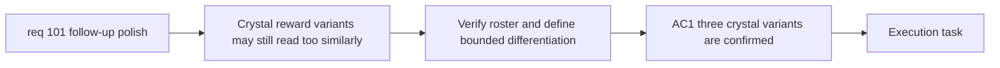

## item_356_define_crystal_variant_completeness_and_reward_pickup_differentiation - Define crystal variant completeness and reward pickup differentiation
> From version: 0.6.1
> Schema version: 1.0
> Status: Ready
> Understanding: 98%
> Confidence: 95%
> Progress: 0%
> Complexity: Medium
> Theme: UI
> Reminder: Update status/understanding/confidence/progress and linked task references when you edit this doc.

# Problem
- `req_101` requires the crystal roster to read as three distinct reward types, but the current runtime presentation may still collapse them visually into one family that is too similar in-scene.
- Without a bounded slice, execution could jump directly into regeneration when a cheaper and acceptable differentiation posture might be color-derived variants within the same family.
- This slice exists to define and deliver crystal completeness first: confirm the three XP-tier crystal variants, decide recolor-vs-generation posture, and keep reward pickup readability coherent.

# Scope
- In:
- verify the current three crystal types against the existing XP-tier roster
- define and deliver the visual differentiation posture for the three crystal types
- prefer color/intensity/aura differentiation inside one family before broader asset regeneration
- keep the change bounded to crystal reward pickup differentiation and readability
- Out:
- non-crystal pickup families
- broader pickup economy rebalance
- generalized pickup-size retuning beyond the existing gold/crystal size wave

# Acceptance criteria
- AC1: The slice confirms the three crystal variants against the current XP-tier reward roster.
- AC2: The slice defines and delivers a bounded visual differentiation posture for the three crystal variants.
- AC3: The preferred first-line solution is color/intensity/aura differentiation within one family unless that is proven insufficient.
- AC4: If a missing or insufficient variant requires generation, that exception is made explicit rather than implied.
- AC5: Runtime review confirms that the three crystal variants remain readable and category-distinct in-scene.

# AC Traceability
- AC1 -> Scope: roster verification. Proof: explicit check against the XP-tier reward roster.
- AC2 -> Scope: bounded differentiation. Proof: explicit crystal differentiation delivery in scope.
- AC3 -> Clarifications: family-preserving differentiation first. Proof: explicit preference for color/intensity/aura before broader regeneration.
- AC4 -> Scope: explicit exception handling. Proof: explicit generation exception posture.
- AC5 -> Scope: runtime readability review. Proof: explicit in-scene validation.

# Decision framing
- Product framing: Required
- Product signals: readability, reward recognition
- Product follow-up: Reuse `prod_017` for gameplay-first readability.
- Architecture framing: Required
- Architecture signals: asset-pipeline compatibility, runtime presentation ownership
- Architecture follow-up: Reuse `adr_052` for asset-resolution posture.

# Links
- Product brief(s): `prod_017_graphical_asset_direction_for_runtime_readability_and_shell_identity`
- Architecture decision(s): `adr_052_adopt_a_content_driven_graphical_asset_pipeline_for_runtime_and_shell_surfaces`
- Request: `req_101_define_a_follow_up_graphics_settings_and_runtime_presentation_polish_wave`
- Primary task(s): `task_070_orchestrate_follow_up_graphics_settings_runtime_presentation_and_skill_icon_wave`

# AI Context
- Summary: Confirm the three crystal reward variants and deliver bounded visual differentiation for them.
- Keywords: crystals, xp tiers, reward pickup readability, variant differentiation, recolor, aura
- Use when: Use when executing the crystal completeness and differentiation slice from req 101.
- Skip when: Skip when the work is about non-crystal pickups or skill icons.

# References
- `games/emberwake/src/content/entities/entityData.ts`
- `src/game/entities/render/EntityScene.tsx`
- `src/game/entities/render/entityPresentation.ts`
- `src/assets/assetCatalog.ts`
