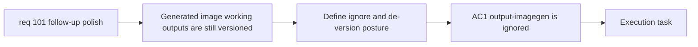

## item_357_define_generated_image_output_repo_hygiene_and_deversioning_posture - Define generated image output repo hygiene and de-versioning posture
> From version: 0.6.1
> Schema version: 1.0
> Status: Done
> Understanding: 100%
> Confidence: 99%
> Progress: 100%
> Complexity: Low
> Theme: UI
> Reminder: Update status/understanding/confidence/progress and linked task references when you edit this doc.

# Problem
- `req_101` calls out that `output/imagegen` currently mixes operator scratch outputs with versioned repository content.
- Without a bounded hygiene slice, execution could either keep noisy generated artifacts in git or delete local operator files that should remain on disk.
- This slice exists to define and deliver the repo-hygiene posture for generated image outputs.

# Scope
- In:
- ignore `output/imagegen/**` through repository gitignore rules
- de-version already-tracked files from that tree without deleting local copies
- keep the change bounded to generated output hygiene rather than broader output-folder policy
- Out:
- deletion of local generated outputs
- changes to runtime-promoted assets under `src/assets`
- broader repo cleanup unrelated to generated image working outputs

# Acceptance criteria
- AC1: The slice ignores `output/imagegen/**` in repository gitignore rules.
- AC2: The slice de-versions already-tracked files from that tree without deleting them from disk.
- AC3: The slice keeps runtime-promoted assets under `src/assets` unaffected.
- AC4: The slice leaves a clear operator posture for where generated scratch outputs should live after the change.

# AC Traceability
- AC1 -> Scope: ignore posture. Proof: explicit gitignore rule for `output/imagegen/**`.
- AC2 -> Scope: de-versioning without deletion. Proof: explicit tracked-file removal from git index only.
- AC3 -> Scope: promoted assets unaffected. Proof: explicit exclusion for `src/assets`.
- AC4 -> Scope: operator posture. Proof: explicit working-output policy.

# Decision framing
- Product framing: Not needed
- Product signals: (none detected)
- Product follow-up: No product brief follow-up is expected.
- Architecture framing: Required
- Architecture signals: delivery and operations, asset workflow ownership
- Architecture follow-up: Reuse `adr_052` for content-driven asset pipeline boundaries.

# Links
- Product brief(s): `prod_017_graphical_asset_direction_for_runtime_readability_and_shell_identity`
- Architecture decision(s): `adr_052_adopt_a_content_driven_graphical_asset_pipeline_for_runtime_and_shell_surfaces`
- Request: `req_101_define_a_follow_up_graphics_settings_and_runtime_presentation_polish_wave`
- Primary task(s): `task_070_orchestrate_follow_up_graphics_settings_runtime_presentation_and_skill_icon_wave`

# AI Context
- Summary: Define repository hygiene for generated image outputs under output/imagegen.
- Keywords: gitignore, imagegen, generated outputs, de-version, scratch artifacts
- Use when: Use when executing the generated-output hygiene slice from req 101.
- Skip when: Skip when the work is about promoted runtime assets or new asset generation itself.

# References
- `.gitignore`
- `output/imagegen/first-wave/selection.json`
- `output/imagegen/directional-entities/selection.json`
