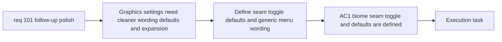

## item_358_define_graphics_settings_expansion_defaults_and_generic_menu_wording - Define graphics settings expansion defaults and generic menu wording
> From version: 0.6.1
> Schema version: 1.0
> Status: Ready
> Understanding: 98%
> Confidence: 95%
> Progress: 0%
> Complexity: Medium
> Theme: UI
> Reminder: Update status/understanding/confidence/progress and linked task references when you edit this doc.

# Problem
- `req_101` expands the `Settings > Graphics` surface again, but the current labels and defaults are still too tied to the first implementation wave.
- Without a bounded slice, menu wording, toggle defaults, and seam-toggle behavior could drift into an inconsistent settings posture.
- This slice exists to define the shell-facing settings wording and preference defaults cleanly before broader settings growth.

# Scope
- In:
- define and deliver a second `Graphics` toggle for biome seam effects
- set both `debug circles` and `biome seams` to disabled by default
- persist both toggles once changed
- make parent settings-menu entries more generic and future-proof
- keep child surfaces explicit unless additional options require wider renaming
- Out:
- the runtime render-path implementation details of circles or seams themselves
- broader settings-system redesign beyond the bounded wording and toggle work

# Acceptance criteria
- AC1: The slice adds a bounded `Graphics` toggle for biome seam effects.
- AC2: The slice sets both debug circles and biome seams to disabled by default.
- AC3: The slice persists both preferences after the operator changes them.
- AC4: The slice makes parent settings-menu entries more generic and future-proof.
- AC5: The slice keeps the resulting settings navigation coherent and discoverable.

# AC Traceability
- AC1 -> Scope: seam toggle. Proof: explicit graphics-toggle delivery for biome seam effects.
- AC2 -> Clarifications: safer defaults. Proof: explicit disabled-by-default posture for both toggles.
- AC3 -> Clarifications: persistence. Proof: explicit persisted preference posture.
- AC4 -> Clarifications: generic wording. Proof: explicit parent-menu renaming.
- AC5 -> Scope: navigation coherence. Proof: explicit requirement to preserve discoverability and coherence.

# Decision framing
- Product framing: Required
- Product signals: settings discoverability, player-facing wording
- Product follow-up: Reuse `prod_017` for player-facing presentation wording.
- Architecture framing: Required
- Architecture signals: preference storage, shell ownership
- Architecture follow-up: Reuse `adr_052` for runtime/shell ownership boundaries.

# Links
- Product brief(s): `prod_017_graphical_asset_direction_for_runtime_readability_and_shell_identity`
- Architecture decision(s): `adr_052_adopt_a_content_driven_graphical_asset_pipeline_for_runtime_and_shell_surfaces`
- Request: `req_101_define_a_follow_up_graphics_settings_and_runtime_presentation_polish_wave`
- Primary task(s): `task_070_orchestrate_follow_up_graphics_settings_runtime_presentation_and_skill_icon_wave`

# AI Context
- Summary: Expand graphics settings with a seam toggle, safer defaults, and more generic parent-menu wording.
- Keywords: settings, graphics, biome seams, debug circles, defaults, persistence, menu wording
- Use when: Use when executing the settings slice from req 101.
- Skip when: Skip when the work is only about runtime render-order or player motion effects.

# References
- `src/app/components/AppMetaScenePanel.tsx`
- `src/app/components/SettingsSceneContent.tsx`
- `src/app/hooks/useShellPreferences.ts`
- `src/shared/lib/shellPreferencesStorage.ts`
