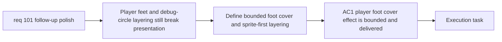

## item_359_define_runtime_presentation_polish_for_player_foot_cover_and_debug_circle_layering - Define runtime presentation polish for player foot cover and debug circle layering
> From version: 0.6.1
> Schema version: 1.0
> Status: Done
> Understanding: 100%
> Confidence: 99%
> Progress: 100%
> Complexity: Medium
> Theme: UI
> Reminder: Update status/understanding/confidence/progress and linked task references when you edit this doc.

# Problem
- `req_101` identifies two runtime presentation gaps: the player still exposes the lack of leg motion too directly, and debug circles can read in front of assets instead of behind them.
- Without a bounded slice, execution could over-scope into a full player re-authoring pass or a broad debug-visual retune instead of targeted runtime polish.
- This slice exists to deliver the bounded runtime presentation fixes only.

# Scope
- In:
- define and deliver a subtle ash-cloud-like foot-cover effect that is strongest during movement
- keep the effect bounded and low-competition with combat readability
- move covered debug circles behind sprite assets across the relevant entity categories
- start with render-order correction before any separate debug-circle style retuning
- Out:
- a full player animation system
- a full player character re-authoring pass
- debug-circle redesign beyond the bounded layer-order correction

# Acceptance criteria
- AC1: The slice adds a bounded player-foot cover effect that is strongest during movement and remains subtle at rest.
- AC2: The effect follows the preferred ash-cloud plus restrained circular-trace art direction unless a bounded correction is needed during implementation.
- AC3: Debug circles render behind sprite assets across the covered entity categories.
- AC4: The slice preserves gameplay readability by avoiding a bright or noisy foot effect.
- AC5: The slice keeps render-order correction primary and does not drift into a broader debug-style redesign.

# AC Traceability
- AC1 -> Scope: bounded movement-cover effect. Proof: explicit player-foot effect delivery in scope.
- AC2 -> Clarifications: ash-cloud direction. Proof: explicit preferred art direction.
- AC3 -> Scope: sprite-first layering. Proof: explicit render-order correction for debug circles.
- AC4 -> Risks: readability preservation. Proof: explicit bounded/noisy-effect guardrail.
- AC5 -> Clarifications: no broader redesign. Proof: explicit render-order-first posture.

# Decision framing
- Product framing: Required
- Product signals: player readability, runtime polish
- Product follow-up: Reuse `prod_017` for gameplay-first presentation polish.
- Architecture framing: Required
- Architecture signals: runtime render ordering, effect ownership
- Architecture follow-up: Reuse `adr_052` for runtime presentation boundaries.

# Links
- Product brief(s): `prod_017_graphical_asset_direction_for_runtime_readability_and_shell_identity`
- Architecture decision(s): `adr_052_adopt_a_content_driven_graphical_asset_pipeline_for_runtime_and_shell_surfaces`
- Request: `req_101_define_a_follow_up_graphics_settings_and_runtime_presentation_polish_wave`
- Primary task(s): `task_070_orchestrate_follow_up_graphics_settings_runtime_presentation_and_skill_icon_wave`

# AI Context
- Summary: Add a subtle foot-cover movement effect for the player and move debug circles behind sprites.
- Keywords: player feet, ash cloud, movement effect, debug circles, layering, z-order
- Use when: Use when executing the runtime presentation polish slice from req 101.
- Skip when: Skip when the work is about settings wording or asset repo hygiene.

# References
- `src/game/entities/render/EntityScene.tsx`
- `src/game/entities/render/entityPresentation.ts`
- `src/assets/entityDirectionalRuntime.ts`
