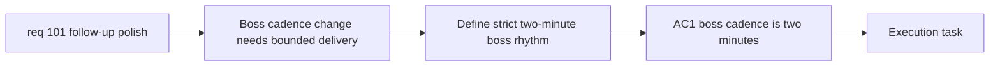

## item_360_define_two_minute_boss_cadence_and_runtime_validation - Define two-minute boss cadence and runtime validation
> From version: 0.6.1
> Schema version: 1.0
> Status: Ready
> Understanding: 98%
> Confidence: 96%
> Progress: 0%
> Complexity: Low
> Theme: Combat
> Reminder: Update status/understanding/confidence/progress and linked task references when you edit this doc.

# Problem
- `req_101` asks for bosses every 2 minutes instead of every 5, but that timing change needs its own bounded delivery slice rather than getting buried inside a broad graphics wave.
- Without a dedicated slice, implementation could change more of the boss system than necessary or leave the first appearance timing ambiguous.
- This slice exists to define and deliver the cadence change only.

# Scope
- In:
- change boss appearance cadence from 5 minutes to a strict 2-minute rhythm
- include the first appearance at 2 minutes by default
- validate the timing in runtime-facing scenarios
- Out:
- broader boss rebalancing
- boss stat or moveset changes
- broader encounter pacing redesign beyond cadence

# Acceptance criteria
- AC1: The slice delivers a strict two-minute boss cadence instead of the current five-minute cadence.
- AC2: The default interpretation includes the first boss appearance at 2 minutes.
- AC3: The slice keeps scope bounded to cadence rather than broader boss rebalance.
- AC4: Runtime validation confirms the new cadence is actually reached as expected.

# AC Traceability
- AC1 -> Scope: cadence change. Proof: explicit 2-minute boss rhythm in scope.
- AC2 -> Clarifications: first appearance timing. Proof: explicit first boss at 2 minutes.
- AC3 -> Scope: bounded balance posture. Proof: explicit exclusions for broader rebalance.
- AC4 -> Scope: runtime validation. Proof: explicit timing validation requirement.

# Decision framing
- Product framing: Required
- Product signals: pressure cadence, encounter pacing
- Product follow-up: No additional product brief is required beyond the request and current product framing.
- Architecture framing: Not needed
- Architecture signals: (none detected)
- Architecture follow-up: No ADR follow-up is expected.

# Links
- Product brief(s): `prod_017_graphical_asset_direction_for_runtime_readability_and_shell_identity`
- Architecture decision(s): `adr_052_adopt_a_content_driven_graphical_asset_pipeline_for_runtime_and_shell_surfaces`
- Request: `req_101_define_a_follow_up_graphics_settings_and_runtime_presentation_polish_wave`
- Primary task(s): `task_070_orchestrate_follow_up_graphics_settings_runtime_presentation_and_skill_icon_wave`

# AI Context
- Summary: Reduce boss cadence from five minutes to a strict two-minute rhythm.
- Keywords: boss cadence, two minutes, encounter timing, validation
- Use when: Use when executing the boss timing slice from req 101.
- Skip when: Skip when the work is about boss balance beyond cadence or about graphics settings.

# References
- `games/emberwake/src/content/world/worldData.ts`
- `games/emberwake/src/config/gameplayTuning.ts`
- `games/emberwake/src/runtime/emberwakeRuntimeIntegration.ts`
