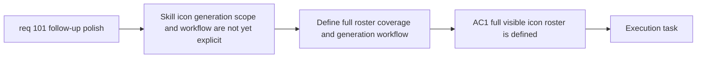

## item_361_define_full_skill_icon_generation_workflow_and_asset_coverage - Define full skill icon generation workflow and asset coverage
> From version: 0.6.1
> Schema version: 1.0
> Status: Done
> Understanding: 100%
> Confidence: 99%
> Progress: 100%
> Complexity: High
> Theme: UI
> Reminder: Update status/understanding/confidence/progress and linked task references when you edit this doc.

# Problem
- `req_101` asks for generated skill icons across the full current roster, but the repo does not yet define that delivery wave as a concrete asset-production slice.
- Without a dedicated slice, implementation could stop at only a few skills, leave fusion-facing icons behind, or invent a second image workflow.
- This slice exists to define the icon-generation workflow and coverage target first.

# Scope
- In:
- define the full current skill-icon roster to cover, including visible fusion-facing icons
- define the generation workflow using the current API-backed image-generation posture
- define how prompts, batches, selections, and promotion candidates should be organized for icons
- keep the delivery bounded to icon-generation preparation and candidate production posture
- Out:
- final UI integration and rollout validation of every generated icon
- broader skill-system redesign
- unrelated runtime asset waves

# Acceptance criteria
- AC1: The slice defines the full current player-facing skill icon roster to cover, including visible fusion-facing icons.
- AC2: The slice reuses the existing API-backed image-generation workflow rather than creating a second asset pipeline.
- AC3: The slice defines prompt, batch, selection, and candidate-output posture for skill icons.
- AC4: The slice keeps the work bounded to generation workflow and coverage rather than immediate full integration.

# AC Traceability
- AC1 -> Clarifications: full roster. Proof: explicit full current skill and visible fusion-facing icon coverage.
- AC2 -> Clarifications: reuse current image workflow. Proof: explicit current API-backed posture reuse.
- AC3 -> Scope: workflow definition. Proof: explicit prompt/batch/selection/candidate posture.
- AC4 -> Scope: bounded delivery. Proof: explicit exclusion of full integration rollout.

# Decision framing
- Product framing: Required
- Product signals: icon cohesion, skill readability
- Product follow-up: Reuse `prod_017` for icon-family consistency.
- Architecture framing: Required
- Architecture signals: asset workflow reuse, content-driven promotion path
- Architecture follow-up: Reuse `adr_052` for asset-pipeline ownership.

# Links
- Product brief(s): `prod_017_graphical_asset_direction_for_runtime_readability_and_shell_identity`
- Architecture decision(s): `adr_052_adopt_a_content_driven_graphical_asset_pipeline_for_runtime_and_shell_surfaces`
- Request: `req_101_define_a_follow_up_graphics_settings_and_runtime_presentation_polish_wave`
- Primary task(s): `task_070_orchestrate_follow_up_graphics_settings_runtime_presentation_and_skill_icon_wave`

# AI Context
- Summary: Define full visible skill-icon coverage and the generation workflow for those icons.
- Keywords: skill icons, fusion icons, image generation, prompts, batches, selections
- Use when: Use when executing the skill-icon generation planning slice from req 101.
- Skip when: Skip when the work is about runtime integration of already-generated icons.

# References
- `logics/specs/spec_001_define_first_wave_asset_production_pack.md`
- `scripts/assets/generateFirstWaveAssets.mjs`
- `scripts/assets/promoteFirstWaveAssets.mjs`
- `src/app/components/SkillIcon.tsx`
- `games/emberwake/src/content/skills`
