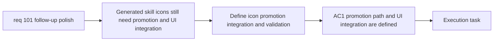

## item_362_define_skill_icon_promotion_integration_and_validation - Define skill icon promotion integration and validation
> From version: 0.6.1
> Schema version: 1.0
> Status: Done
> Understanding: 100%
> Confidence: 99%
> Progress: 100%
> Complexity: High
> Theme: UI
> Reminder: Update status/understanding/confidence/progress and linked task references when you edit this doc.

# Problem
- Even with icon-generation workflow defined, `req_101` still needs a bounded slice for how generated skill icons are promoted, wired into the UI, and validated.
- Without a dedicated integration slice, the project could generate icon candidates but never land a coherent player-facing icon family across skills and visible fusions.
- This slice exists to define and deliver promotion, integration, and validation of the generated icon wave.

# Scope
- In:
- define and deliver the promotion posture from generated icon candidates to runtime/shell assets
- wire promoted icons into the current player-facing skill surfaces
- validate icon readability, family consistency, and placeholder replacement coverage
- keep the integration bounded to the current visible skill and visible fusion-facing surfaces
- Out:
- a broader redesign of skill UI beyond icon replacement
- unrelated hostile/player/pickup asset waves

# Acceptance criteria
- AC1: The slice defines the promotion path from generated icon candidates into the actual icon assets consumed by the app.
- AC2: The slice wires promoted icons into the current visible skill and fusion-facing player surfaces.
- AC3: The slice validates readability and family consistency across the integrated icon set.
- AC4: The slice leaves placeholder icons only where an explicit deferred exception is documented.

# AC Traceability
- AC1 -> Scope: promotion posture. Proof: explicit candidate-to-runtime promotion definition.
- AC2 -> Scope: current visible surfaces. Proof: explicit UI integration across visible skill/fusion surfaces.
- AC3 -> Scope: icon validation. Proof: explicit readability and consistency validation.
- AC4 -> Scope: explicit exceptions only. Proof: explicit deferred-placeholder handling.

# Decision framing
- Product framing: Required
- Product signals: UI consistency, icon readability
- Product follow-up: Reuse `prod_017` for player-facing icon-family cohesion.
- Architecture framing: Required
- Architecture signals: asset promotion, content-driven resolution
- Architecture follow-up: Reuse `adr_052` for runtime/shell asset ownership.

# Links
- Product brief(s): `prod_017_graphical_asset_direction_for_runtime_readability_and_shell_identity`
- Architecture decision(s): `adr_052_adopt_a_content_driven_graphical_asset_pipeline_for_runtime_and_shell_surfaces`
- Request: `req_101_define_a_follow_up_graphics_settings_and_runtime_presentation_polish_wave`
- Primary task(s): `task_070_orchestrate_follow_up_graphics_settings_runtime_presentation_and_skill_icon_wave`

# AI Context
- Summary: Promote generated skill icons into the app and validate them across visible skill surfaces.
- Keywords: skill icons, promotion, integration, validation, fusion icons, placeholders
- Use when: Use when executing the icon integration slice from req 101.
- Skip when: Skip when the work is only about generating icon candidates.

# References
- `src/app/components/SkillIcon.tsx`
- `src/app/components/GrowthScene.tsx`
- `src/app/components/AppMetaScenePanel.tsx`
- `src/assets/assetCatalog.ts`
- `src/assets/assetResolver.ts`
