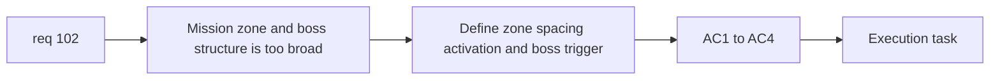

## item_363_define_primary_map_mission_zone_selection_and_boss_encounter_structure - Define primary map mission zone selection and boss encounter structure
> From version: 0.6.1
> Schema version: 1.0
> Status: Done
> Understanding: 98%
> Confidence: 95%
> Progress: 100%
> Complexity: High
> Theme: Gameplay
> Reminder: Update status/understanding/confidence/progress and linked task references when you edit this doc.

# Problem
- `req_102` needs a concrete slice for how three mission zones are selected, spaced, activated, and tied to mission-boss encounters.
- Without a bounded structure slice, the mission system remains too broad to implement safely.

# Scope
- In:
- define three mission-zone ownership and activation posture
- define the `10000 world units` spacing contract
- define one active zone at a time
- define immediate mission-boss trigger on active-zone arrival
- define distinction between mission bosses and existing periodic mini-bosses
- Out:
- mission-item ownership details
- off-screen arrows
- map-exit unlock and full mission completion handoff

# Acceptance criteria
- AC1: The slice defines how three mission zones are selected or authored inside a run.
- AC2: The slice defines and preserves the minimum `10000 world units` spacing contract between mission-boss zones.
- AC3: The slice defines that only one mission zone is active at a time in the first wave.
- AC4: The slice defines that entering the active zone immediately triggers its mission-boss encounter.

# AC Traceability
- AC1 -> Scope: zone ownership. Proof: mission-zone structure defined.
- AC2 -> Scope: spacing contract. Proof: explicit distance guarantee.
- AC3 -> Scope: one active zone. Proof: activation order is bounded.
- AC4 -> Scope: mission boss trigger. Proof: zone arrival starts boss encounter.

# Decision framing
- Product framing: Required
- Product signals: traversal clarity, mission readability
- Product follow-up: create a mission-loop brief only if execution reveals major ambiguity.
- Architecture framing: Optional
- Architecture signals: zone placement ownership and mission-state ownership
- Architecture follow-up: escalate to ADR only if mission-state ownership collides with existing runtime seams.

# Links
- Product brief(s): (none yet)
- Architecture decision(s): (none yet)
- Request: `req_102_define_a_primary_map_mission_loop_with_three_target_zones_bosses_and_key_items`
- Primary task(s): `task_071_orchestrate_mission_progression_world_ladder_and_main_screen_background_wave`

# AI Context
- Summary: Split out mission-zone selection, spacing, and boss-trigger structure from req 102.
- Keywords: mission zones, boss triggers, spacing, map traversal
- Use when: Use when implementing the structural first half of the primary map mission loop.
- Skip when: Skip when working only on mission items, off-screen arrows, or map unlock UI.

# References
- `games/emberwake/src/content/world/worldGeneration.ts`
- `games/emberwake/src/runtime/entitySimulation.ts`
- `games/emberwake/src/runtime/hostilePressure.ts`
