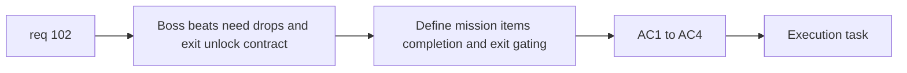

## item_364_define_primary_map_mission_item_collection_and_map_exit_unlock - Define primary map mission item collection and map exit unlock
> From version: 0.6.1
> Schema version: 1.0
> Status: Ready
> Understanding: 98%
> Confidence: 95%
> Progress: 0%
> Complexity: High
> Theme: Gameplay
> Reminder: Update status/understanding/confidence/progress and linked task references when you edit this doc.

# Problem
- `req_102` also needs a separate slice for mission-item drops, automatic collection, completion state, and exit unlocking.
- Without this slice, mission-boss encounters would exist without a clear completion contract.

# Scope
- In:
- define mission-item drops for the three mission bosses
- define automatic pickup on contact
- define completion state once all three items are collected
- define map-exit unlock only after mission completion
- Out:
- mission-zone placement
- off-screen guidance arrows
- later side-quest structure

# Acceptance criteria
- AC1: The slice defines one mission-item drop per mission boss.
- AC2: The slice defines automatic mission-item pickup on contact.
- AC3: The slice defines that the primary mission completes only after all three items are collected.
- AC4: The slice defines that map departure remains locked until the mission is complete.

# AC Traceability
- AC1 -> Scope: boss-drop contract. Proof: one drop per boss.
- AC2 -> Scope: pickup posture. Proof: automatic collection defined.
- AC3 -> Scope: mission completion. Proof: item collection closes mission.
- AC4 -> Scope: exit gating. Proof: map departure tied to completion state.

# Decision framing
- Product framing: Required
- Product signals: completion clarity, extraction gating
- Product follow-up: none.
- Architecture framing: Optional
- Architecture signals: mission-item ownership, exit-state ownership
- Architecture follow-up: none yet.

# Links
- Product brief(s): (none yet)
- Architecture decision(s): (none yet)
- Request: `req_102_define_a_primary_map_mission_loop_with_three_target_zones_bosses_and_key_items`
- Primary task(s): `task_071_orchestrate_mission_progression_world_ladder_and_main_screen_background_wave`

# AI Context
- Summary: Split out mission-item collection and exit unlock from req 102.
- Keywords: mission item, drop, completion, exit unlock
- Use when: Use when implementing the reward/completion half of the primary mission loop.
- Skip when: Skip when working only on zone spacing or off-screen guidance.

# References
- `games/emberwake/src/runtime/entitySimulation.ts`
- `games/emberwake/src/runtime/entitySimulationCombat.ts`
- `src/app/AppShell.tsx`
