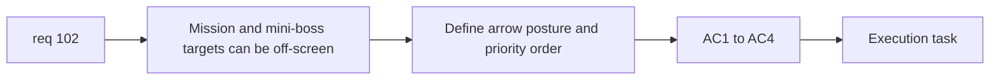

## item_365_define_offscreen_mission_and_miniboss_guidance_arrow_posture - Define offscreen mission and mini-boss guidance arrow posture
> From version: 0.6.1
> Schema version: 1.0
> Status: Ready
> Understanding: 98%
> Confidence: 95%
> Progress: 0%
> Complexity: Medium
> Theme: UI
> Reminder: Update status/understanding/confidence/progress and linked task references when you edit this doc.

# Problem
- `req_102` needs a bounded guidance slice so players can find mission zones, mission bosses, mission drops, and off-screen mini-bosses.
- Without a clear priority order, the arrow system could become noisy or contradictory.

# Scope
- In:
- define a player-local off-screen guidance arrow
- define target priority: mission drop, mission objective, then mini-boss
- define visibility only when target is off-screen
- define reuse of the same posture for mini-bosses
- Out:
- minimap systems
- mission-zone generation
- boss drop logic itself

# Acceptance criteria
- AC1: The slice defines a bounded off-screen guidance arrow anchored around the player.
- AC2: The slice defines that mission drops, mission objectives, and mission bosses can own the arrow when off-screen.
- AC3: The slice defines a strict priority order where mission guidance wins over mini-boss guidance.
- AC4: The slice reuses the same guidance posture for mini-bosses when no higher-priority mission target is active off-screen.

# AC Traceability
- AC1 -> Scope: arrow system. Proof: player-local locator defined.
- AC2 -> Scope: target coverage. Proof: mission targets enumerated.
- AC3 -> Scope: priority rule. Proof: target precedence explicit.
- AC4 -> Scope: mini-boss reuse. Proof: arrow reused secondarily.

# Decision framing
- Product framing: Required
- Product signals: mission readability, threat discoverability
- Product follow-up: none.
- Architecture framing: Optional
- Architecture signals: HUD ownership and target-selection seam
- Architecture follow-up: none yet.

# Links
- Product brief(s): (none yet)
- Architecture decision(s): (none yet)
- Request: `req_102_define_a_primary_map_mission_loop_with_three_target_zones_bosses_and_key_items`
- Primary task(s): `task_071_orchestrate_mission_progression_world_ladder_and_main_screen_background_wave`

# AI Context
- Summary: Split out off-screen guidance from req 102 with explicit mission-first priority.
- Keywords: off-screen arrow, mission guidance, mini-boss guidance, priority
- Use when: Use when implementing player-facing objective and threat direction cues.
- Skip when: Skip when working only on mission state or world unlocks.

# References
- `src/game/render/RuntimeSurface.tsx`
- `src/game/entities/render/EntityScene.tsx`
- `src/app/AppShell.tsx`
