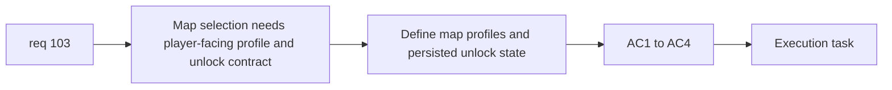

## item_366_define_authored_map_profile_and_unlock_state_contract_for_new_game_selection - Define authored map profile and unlock state contract for new game selection
> From version: 0.6.1
> Schema version: 1.0
> Status: Ready
> Understanding: 98%
> Confidence: 96%
> Progress: 0%
> Complexity: Medium
> Theme: Progression
> Reminder: Update status/understanding/confidence/progress and linked task references when you edit this doc.

# Problem
- `req_103` needs a data-contract slice for player-facing map profiles and persisted unlock state.
- Without that seam, new-game selection risks exposing raw seeds instead of authored world choices.

# Scope
- In:
- define authored map profiles
- define map one unlocked by default
- define map two unlock from map one mission completion
- define persistent unlock facts in meta progression
- Out:
- the visual world-selection screen itself
- full five-world authored ladder

# Acceptance criteria
- AC1: The slice defines authored map profiles rather than exposing raw seed strings directly to players.
- AC2: The slice defines map one as unlocked by default.
- AC3: The slice defines map two as unlocked by map one primary-mission completion.
- AC4: The slice defines persistence ownership for map unlock facts in meta progression.

# AC Traceability
- AC1 -> Scope: authored profiles. Proof: player-facing map contract defined.
- AC2 -> Scope: default unlock. Proof: map one starts available.
- AC3 -> Scope: mission gate. Proof: second map tied to first mission completion.
- AC4 -> Scope: persistence. Proof: unlock state owned by meta progression.

# Decision framing
- Product framing: Required
- Product signals: progression clarity, authored world identity
- Product follow-up: none.
- Architecture framing: Optional
- Architecture signals: profile and persistence ownership
- Architecture follow-up: none yet.

# Links
- Product brief(s): (none yet)
- Architecture decision(s): (none yet)
- Request: `req_103_define_new_game_map_selection_and_mission_gated_map_unlock_progression`
- Primary task(s): `task_071_orchestrate_mission_progression_world_ladder_and_main_screen_background_wave`

# AI Context
- Summary: Define the data and persistence contract behind new-game map selection.
- Keywords: map profiles, unlock state, meta progression, new game
- Use when: Use when implementing the structural seam behind world selection.
- Skip when: Skip when working only on the shell card UI.

# References
- `src/app/model/metaProgression.ts`
- `games/emberwake/src/runtime/emberwakeSession.ts`
- `src/shared/lib/runtimeSessionStorage.ts`
