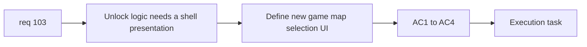

## item_367_define_new_game_map_selection_shell_surface_and_locked_state_presentation - Define new game map selection shell surface and locked state presentation
> From version: 0.6.1
> Schema version: 1.0
> Status: Done
> Understanding: 98%
> Confidence: 96%
> Progress: 100%
> Complexity: Medium
> Theme: UI
> Reminder: Update status/understanding/confidence/progress and linked task references when you edit this doc.

# Problem
- `req_103` also needs a player-facing selection screen slice.
- Without a dedicated shell slice, unlock logic might exist without a readable new-game flow.

# Scope
- In:
- define map choice inside `new game`
- show unlocked vs locked maps visibly
- keep locked maps disabled but visible
- keep screen simple: name, lock state, short description
- Out:
- full campaign-overworld design
- five-world premium card enrichment

# Acceptance criteria
- AC1: The slice defines a map-choice step inside the new-game flow.
- AC2: The slice shows locked maps visibly but as unavailable.
- AC3: The slice keeps the first-wave selection screen simple and readable.
- AC4: The slice connects player-facing map choice to the authored map profile contract.

# AC Traceability
- AC1 -> Scope: new game map choice. Proof: selection step explicit.
- AC2 -> Scope: locked-state presentation. Proof: locked maps visible but disabled.
- AC3 -> Scope: bounded UI. Proof: simple posture retained.
- AC4 -> Scope: profile linkage. Proof: player selection bound to authored map profiles.

# Decision framing
- Product framing: Required
- Product signals: clarity of progression and destination choice
- Product follow-up: none.
- Architecture framing: Optional
- Architecture signals: shell routing and selection-state ownership
- Architecture follow-up: none.

# Links
- Product brief(s): (none yet)
- Architecture decision(s): (none yet)
- Request: `req_103_define_new_game_map_selection_and_mission_gated_map_unlock_progression`
- Primary task(s): `task_071_orchestrate_mission_progression_world_ladder_and_main_screen_background_wave`

# AI Context
- Summary: Define the shell surface for new-game map selection and locked-state presentation.
- Keywords: new game, map selection, locked maps, shell UI
- Use when: Use when implementing the player-facing req 103 surface.
- Skip when: Skip when working only on persistence or mission completion flags.

# References
- `src/app/AppShell.tsx`
- `src/app/components/AppMetaScenePanel.tsx`
- `src/app/model/appScene.ts`
