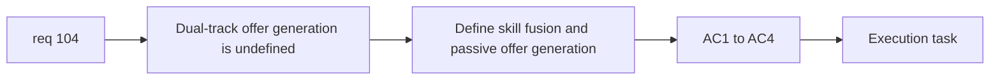

## item_368_define_dual_track_level_up_offer_generation_for_skill_fusion_and_passive_choices - Define dual-track level-up offer generation for skill, fusion, and passive choices
> From version: 0.6.1
> Schema version: 1.0
> Status: Ready
> Understanding: 98%
> Confidence: 96%
> Progress: 0%
> Complexity: High
> Theme: Progression
> Reminder: Update status/understanding/confidence/progress and linked task references when you edit this doc.

# Problem
- `req_104` needs a runtime-offer generation slice before any UI can exist.
- The build system must know how to produce `3 skills/fusions` and `3 passives` without collapsing into one mixed pool.

# Scope
- In:
- define dual-track offer generation
- define fusion eligibility inside the skill/fusion track
- define one choice total from six visible offers
- define fallback behavior when a track cannot fill cleanly
- define full-slot behavior for active track
- Out:
- reroll/pass charges
- level-up UI rendering
- shop upgrade ownership

# Acceptance criteria
- AC1: The slice defines how the system generates `3 skills/fusions` and `3 passives`.
- AC2: The slice defines how fusions participate in the skill/fusion track.
- AC3: The slice defines that the player picks one reward total from the six visible offers.
- AC4: The slice defines fallback behavior for constrained candidate pools and full active-slot states.

# AC Traceability
- AC1 -> Scope: dual tracks. Proof: separate offer-generation posture defined.
- AC2 -> Scope: fusion role. Proof: fusion eligibility and surfacing defined.
- AC3 -> Scope: one pick total. Proof: selection contract explicit.
- AC4 -> Scope: constrained pools. Proof: fallback and full-slot behavior covered.

# Decision framing
- Product framing: Required
- Product signals: progression clarity and authored build identity
- Product follow-up: none.
- Architecture framing: Required
- Architecture signals: build-system offer ownership
- Architecture follow-up: reuse existing build-system seams.

# Links
- Product brief(s): `prod_008_active_passive_fusion_direction_for_emberwake`, `prod_009_level_up_slots_and_run_progression_model_for_emberwake`
- Architecture decision(s): `adr_039_structure_the_first_survivor_build_loop_around_separate_active_and_passive_slots`, `adr_040_use_curated_active_passive_fusions_as_the_foundational_build_payoff_layer`
- Request: `req_104_define_a_dual_track_level_up_choice_model_with_reroll_and_pass_meta_limits`
- Primary task(s): `task_071_orchestrate_mission_progression_world_ladder_and_main_screen_background_wave`

# AI Context
- Summary: Define the runtime offer-generation core for req 104.
- Keywords: level-up offers, dual track, fusion eligibility, passives
- Use when: Use when implementing the underlying level-up choice generation model.
- Skip when: Skip when working only on reroll/pass UI or shop limits.

# References
- `games/emberwake/src/runtime/buildSystem.ts`
- `games/emberwake/src/runtime/buildSystem.test.ts`
