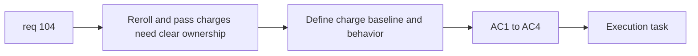

## item_369_define_reroll_and_pass_charge_ownership_for_level_up_choices - Define reroll and pass charge ownership for level-up choices
> From version: 0.6.1
> Schema version: 1.0
> Status: Done
> Understanding: 98%
> Confidence: 96%
> Progress: 100%
> Complexity: Medium
> Theme: Progression
> Reminder: Update status/understanding/confidence/progress and linked task references when you edit this doc.

# Problem
- `req_104` also needs a bounded charge-ownership slice for `roll` and `pass`.
- Without it, the new offer model cannot expose reroll/skip as meaningful run resources.

# Scope
- In:
- define `1 reroll` and `1 pass` per run baseline
- define reroll refreshing both tracks together
- define pass as a pure skip consuming the gain moment
- define avoidance of immediate identical reroll sets where possible
- define charges as per-run resources with shop-expandable maxima later
- Out:
- full shop implementation
- richer level-up UI layout

# Acceptance criteria
- AC1: The slice defines baseline per-run charges for reroll and pass.
- AC2: The slice defines reroll behavior across both tracks together.
- AC3: The slice defines pass as a pure skip that consumes the current gain moment.
- AC4: The slice frames charge maxima as later shop-expandable without requiring shop implementation now.

# AC Traceability
- AC1 -> Scope: baseline charges. Proof: per-run defaults defined.
- AC2 -> Scope: reroll behavior. Proof: both-track refresh explicit.
- AC3 -> Scope: pass behavior. Proof: pure skip defined.
- AC4 -> Scope: shop seam. Proof: future max upgrade seam explicit.

# Decision framing
- Product framing: Required
- Product signals: agency, tension, fairness
- Product follow-up: none.
- Architecture framing: Optional
- Architecture signals: run-owned charge state vs meta-owned max state
- Architecture follow-up: none yet.

# Links
- Product brief(s): `prod_009_level_up_slots_and_run_progression_model_for_emberwake`
- Architecture decision(s): (none yet)
- Request: `req_104_define_a_dual_track_level_up_choice_model_with_reroll_and_pass_meta_limits`
- Primary task(s): `task_071_orchestrate_mission_progression_world_ladder_and_main_screen_background_wave`

# AI Context
- Summary: Define reroll and pass as bounded run resources for req 104.
- Keywords: reroll, pass, charges, shop seam, level-up
- Use when: Use when implementing level-up skip and refresh resources.
- Skip when: Skip when working only on offer generation or final shell layout.

# References
- `games/emberwake/src/runtime/buildSystem.ts`
- `src/app/model/metaProgression.ts`
