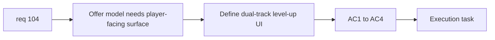

## item_370_define_dual_track_level_up_surface_and_validation - Define dual-track level-up surface and validation
> From version: 0.6.1
> Schema version: 1.0
> Status: Ready
> Understanding: 98%
> Confidence: 96%
> Progress: 0%
> Complexity: Medium
> Theme: UI
> Reminder: Update status/understanding/confidence/progress and linked task references when you edit this doc.

# Problem
- `req_104` finally needs a player-facing level-up surface slice.
- Without a bounded UI slice, the underlying offer model and charge rules will remain invisible.

# Scope
- In:
- define a stable two-track level-up layout
- show 3 skills/fusions and 3 passives
- surface reroll and pass charges
- validate readability and one-pick-total interaction
- Out:
- chest rewards or other future reward surfaces
- full visual redesign of all progression panels

# Acceptance criteria
- AC1: The slice defines a readable two-track level-up surface.
- AC2: The slice surfaces the six offers and the one-pick-total interaction cleanly.
- AC3: The slice surfaces reroll and pass charges clearly.
- AC4: The slice includes validation for readability and constrained-pool behavior.

# AC Traceability
- AC1 -> Scope: layout. Proof: two-track surface defined.
- AC2 -> Scope: interaction. Proof: six offers and one pick total surfaced.
- AC3 -> Scope: charge visibility. Proof: reroll/pass surfaced.
- AC4 -> Scope: validation. Proof: readability and edge cases validated.

# Decision framing
- Product framing: Required
- Product signals: clarity, pace, strategic readability
- Product follow-up: reuse existing shell/progression visual language.
- Architecture framing: Optional
- Architecture signals: surface ownership only
- Architecture follow-up: none.

# Links
- Product brief(s): `prod_009_level_up_slots_and_run_progression_model_for_emberwake`
- Architecture decision(s): (none yet)
- Request: `req_104_define_a_dual_track_level_up_choice_model_with_reroll_and_pass_meta_limits`
- Primary task(s): `task_071_orchestrate_mission_progression_world_ladder_and_main_screen_background_wave`

# AI Context
- Summary: Define the player-facing level-up surface for req 104 and validate it.
- Keywords: level-up UI, reroll, pass, six offers
- Use when: Use when delivering the visible layer of the dual-track progression model.
- Skip when: Skip when working only on runtime offer generation.

# References
- `src/app/AppShell.tsx`
- `src/app/components/AppMetaScenePanel.tsx`
