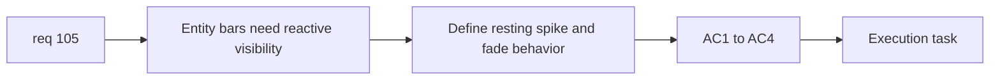

## item_371_define_state_reactive_runtime_entity_bar_visibility_and_fade_behavior - Define state-reactive runtime entity bar visibility and fade behavior
> From version: 0.6.1
> Schema version: 1.0
> Status: Ready
> Understanding: 99%
> Confidence: 97%
> Progress: 0%
> Complexity: Medium
> Theme: Runtime
> Reminder: Update status/understanding/confidence/progress and linked task references when you edit this doc.

# Problem
- `req_105` is already tightly bounded and only needs one execution slice.

# Scope
- In:
- define quiet resting alpha for entity bars
- define health-change spike in bar visibility
- define `~2s` fade back to resting state
- validate category coverage and runtime readability
- Out:
- HUD redesign
- damage-number redesign

# Acceptance criteria
- AC1: The slice defines subdued resting visibility for bars.
- AC2: The slice defines an immediate visibility spike on health change.
- AC3: The slice defines a fade of about 2 seconds back to resting state.
- AC4: The slice validates the behavior across current bar-owning entity categories.

# AC Traceability
- AC1 -> Scope: resting posture. Proof: low resting alpha defined.
- AC2 -> Scope: reactive spike. Proof: health change triggers visibility.
- AC3 -> Scope: fade window. Proof: 2-second fade defined.
- AC4 -> Scope: coverage. Proof: categories validated.

# Decision framing
- Product framing: Required
- Product signals: combat readability
- Product follow-up: none.
- Architecture framing: Optional
- Architecture signals: render-state ownership only
- Architecture follow-up: none.

# Links
- Product brief(s): (none yet)
- Architecture decision(s): (none yet)
- Request: `req_105_define_a_state_reactive_entity_bar_visibility_posture_with_two_second_fade`
- Primary task(s): `task_071_orchestrate_mission_progression_world_ladder_and_main_screen_background_wave`

# AI Context
- Summary: Execute the full req 105 bar-visibility slice as one bounded item.
- Keywords: entity bars, visibility spike, 2-second fade
- Use when: Use when implementing req 105.
- Skip when: Skip when working on unrelated HUD systems.

# References
- `src/game/entities/render/EntityScene.tsx`
- `games/emberwake/src/runtime/entitySimulation.ts`
