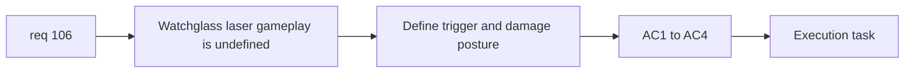

## item_372_define_watchglass_close_range_laser_gameplay_and_trigger_posture - Define watchglass close-range laser gameplay and trigger posture
> From version: 0.6.1
> Schema version: 1.0
> Status: Done
> Understanding: 98%
> Confidence: 96%
> Progress: 100%
> Complexity: Medium
> Theme: Gameplay
> Reminder: Update status/understanding/confidence/progress and linked task references when you edit this doc.

# Problem
- `req_106` needs a bounded gameplay slice for how watchglass acquires and fires its close-range laser.

# Scope
- In:
- define close-range trigger conditions
- define low-damage laser resolution
- define relation to existing contact-pressure posture
- decide first-wave coverage for `watchglass` vs `watchglass-prime`
- Out:
- polished VFX pass
- broad ranged hostile framework

# Acceptance criteria
- AC1: The slice defines when `watchglass` can use the close-range laser.
- AC2: The slice keeps laser damage modest.
- AC3: The slice defines the relationship between laser pressure and existing contact pressure.
- AC4: The slice defines first-wave coverage for `watchglass` and `watchglass-prime`.

# AC Traceability
- AC1 -> Scope: trigger posture. Proof: close-range condition explicit.
- AC2 -> Scope: damage posture. Proof: low-damage target explicit.
- AC3 -> Scope: coexistence. Proof: contact-pressure relationship defined.
- AC4 -> Scope: family coverage. Proof: watchglass vs prime decision explicit.

# Decision framing
- Product framing: Required
- Product signals: hostile identity, fairness
- Product follow-up: none.
- Architecture framing: Optional
- Architecture signals: hostile intent/attack ownership
- Architecture follow-up: none.

# Links
- Product brief(s): (none yet)
- Architecture decision(s): `adr_049_structure_time_scaled_enemy_pressure_around_authored_population_opening_composition_tiers_and_mini_boss_beats`
- Request: `req_106_define_a_bounded_close_range_red_laser_attack_for_watchglass`
- Primary task(s): `task_071_orchestrate_mission_progression_world_ladder_and_main_screen_background_wave`

# AI Context
- Summary: Define the gameplay half of the watchglass laser feature.
- Keywords: watchglass, laser, trigger, low damage
- Use when: Use when implementing watchglass beam behavior.
- Skip when: Skip when working only on feedback art.

# References
- `games/emberwake/src/runtime/hostilePressure.ts`
- `games/emberwake/src/runtime/entitySimulationIntent.ts`
- `games/emberwake/src/runtime/entitySimulationCombat.ts`
