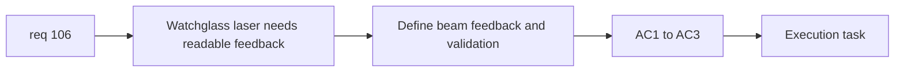

## item_373_define_watchglass_red_laser_feedback_and_runtime_validation - Define watchglass red laser feedback and runtime validation
> From version: 0.6.1
> Schema version: 1.0
> Status: Done
> Understanding: 98%
> Confidence: 96%
> Progress: 100%
> Complexity: Medium
> Theme: UI
> Reminder: Update status/understanding/confidence/progress and linked task references when you edit this doc.

# Problem
- `req_106` also needs a presentation slice so the laser is readable and testable in live runtime.

# Scope
- In:
- define readable red beam or telegraph posture
- validate it in combat scenes
- ensure readability without a broad VFX rewrite
- Out:
- generic beam framework for all hostiles
- full hostile feedback overhaul

# Acceptance criteria
- AC1: The slice defines a readable red feedback posture for the watchglass laser.
- AC2: The slice validates readability and timing in runtime play.
- AC3: The slice stays bounded and does not widen into a full beam-VFX architecture.

# AC Traceability
- AC1 -> Scope: red feedback. Proof: beam/telegraph readability posture explicit.
- AC2 -> Scope: validation. Proof: runtime combat validation explicit.
- AC3 -> Scope: boundedness. Proof: no generic framework required.

# Decision framing
- Product framing: Required
- Product signals: threat readability
- Product follow-up: none.
- Architecture framing: Optional
- Architecture signals: feedback ownership only
- Architecture follow-up: none.

# Links
- Product brief(s): (none yet)
- Architecture decision(s): (none yet)
- Request: `req_106_define_a_bounded_close_range_red_laser_attack_for_watchglass`
- Primary task(s): `task_071_orchestrate_mission_progression_world_ladder_and_main_screen_background_wave`

# AI Context
- Summary: Define the feedback and validation half of the watchglass laser feature.
- Keywords: watchglass, red laser, feedback, validation
- Use when: Use when implementing runtime readability for req 106.
- Skip when: Skip when working only on hostile damage logic.

# References
- `src/game/render/CombatSkillFeedbackScene.tsx`
- `src/game/entities/model/entitySimulation.test.ts`
