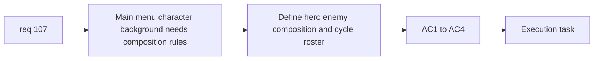

## item_374_define_main_menu_background_character_composition_and_asset_roster - Define main menu background character composition and asset roster
> From version: 0.6.1
> Schema version: 1.0
> Status: Done
> Understanding: 98%
> Confidence: 96%
> Progress: 100%
> Complexity: Medium
> Theme: UI
> Reminder: Update status/understanding/confidence/progress and linked task references when you edit this doc.

# Problem
- `req_107` needs a bounded composition slice for the right-hero/left-enemy background and the curated enemy roster.

# Scope
- In:
- define hero on right facing left
- define enemy on left facing right
- define curated hostile roster including bosses
- define slow auto-cycle cadence and boss rarity
- Out:
- full shell scene rollout
- shell-wide animation system

# Acceptance criteria
- AC1: The slice defines the large hero-right/enemy-left composition.
- AC2: The slice defines a curated enemy roster including bosses.
- AC3: The slice defines slow automatic cycling and lower boss frequency.
- AC4: The slice remains specific to `main-menu`.

# AC Traceability
- AC1 -> Scope: composition. Proof: left/right facing rule explicit.
- AC2 -> Scope: roster. Proof: curated enemy set explicit.
- AC3 -> Scope: cycle. Proof: cadence and rarity explicit.
- AC4 -> Scope: boundedness. Proof: `main-menu` only.

# Decision framing
- Product framing: Required
- Product signals: front-door appeal, silhouette clarity
- Product follow-up: none.
- Architecture framing: Optional
- Architecture signals: shell asset composition ownership
- Architecture follow-up: none.

# Links
- Product brief(s): `prod_017_graphical_asset_direction_for_runtime_readability_and_shell_identity`
- Architecture decision(s): `adr_052_adopt_a_content_driven_graphical_asset_pipeline_for_runtime_and_shell_surfaces`
- Request: `req_107_define_a_main_screen_background_presentation_using_runtime_character_and_enemy_assets`
- Primary task(s): `task_071_orchestrate_mission_progression_world_ladder_and_main_screen_background_wave`

# AI Context
- Summary: Define the asset roster and composition rules for the main-menu character background.
- Keywords: main menu, background, hero, enemy, bosses, cycle
- Use when: Use when implementing the structural half of req 107.
- Skip when: Skip when working only on CSS layering polish.

# References
- `src/app/components/AppMetaScenePanel.tsx`
- `src/assets/entities/runtime/entity.player.primary.runtime.png`
- `src/assets/entities/runtime/entity.hostile.watcher.runtime.png`
