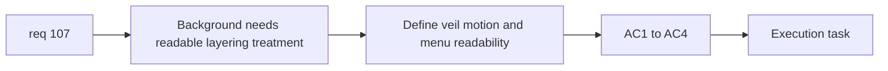

## item_375_define_main_menu_background_layering_motion_and_readability_treatment - Define main menu background layering, motion, and readability treatment
> From version: 0.6.1
> Schema version: 1.0
> Status: Ready
> Understanding: 98%
> Confidence: 96%
> Progress: 0%
> Complexity: Medium
> Theme: UI
> Reminder: Update status/understanding/confidence/progress and linked task references when you edit this doc.

# Problem
- `req_107` also needs a rendering-treatment slice so the menu stays readable above the background assets.

# Scope
- In:
- define menu-on-top layering
- define restrained veil or gradient to protect legibility
- define restrained drift/parallax only
- validate the result in `main-menu`
- Out:
- full animation pass
- shell-wide background system

# Acceptance criteria
- AC1: The slice defines layering that keeps the menu readable and interactive above the background.
- AC2: The slice defines restrained central readability protection such as a soft veil or gradient.
- AC3: The slice defines only restrained background motion or parallax.
- AC4: The slice validates the result on the main menu.

# AC Traceability
- AC1 -> Scope: layering. Proof: menu foreground posture explicit.
- AC2 -> Scope: veil treatment. Proof: central readability protection defined.
- AC3 -> Scope: motion limits. Proof: restrained drift only.
- AC4 -> Scope: validation. Proof: main-menu review required.

# Decision framing
- Product framing: Required
- Product signals: legibility, premium feel
- Product follow-up: none.
- Architecture framing: Optional
- Architecture signals: shell CSS and layer ownership
- Architecture follow-up: none.

# Links
- Product brief(s): `prod_017_graphical_asset_direction_for_runtime_readability_and_shell_identity`
- Architecture decision(s): `adr_052_adopt_a_content_driven_graphical_asset_pipeline_for_runtime_and_shell_surfaces`
- Request: `req_107_define_a_main_screen_background_presentation_using_runtime_character_and_enemy_assets`
- Primary task(s): `task_071_orchestrate_mission_progression_world_ladder_and_main_screen_background_wave`

# AI Context
- Summary: Define the readability and motion treatment for the main-menu background.
- Keywords: menu layering, veil, gradient, parallax, readability
- Use when: Use when finishing req 107 with safe shell layering.
- Skip when: Skip when working only on the asset roster.

# References
- `src/app/styles/app.css`
- `src/app/components/AppMetaScenePanel.tsx`
