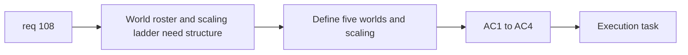

## item_376_define_five_authored_world_profiles_and_world_based_hostile_scaling - Define five authored world profiles and world-based hostile scaling
> From version: 0.6.1
> Schema version: 1.0
> Status: Done
> Understanding: 98%
> Confidence: 96%
> Progress: 100%
> Complexity: High
> Theme: Progression
> Reminder: Update status/understanding/confidence/progress and linked task references when you edit this doc.

# Problem
- `req_108` needs a structural slice for the five-world roster and the `+10%/+10%` world scaling ladder.

# Scope
- In:
- define five authored world profiles with names
- define strict unlock order
- define cumulative hostile `+10% health` and `+10% damage` from world 2 onward
- keep world 1 as baseline
- Out:
- world-card UI
- attempt-count persistence details
- representative asset generation

# Acceptance criteria
- AC1: The slice defines the five authored world profiles and names.
- AC2: The slice defines a strict unlock order across those five worlds.
- AC3: The slice defines cumulative hostile `+10% health` and `+10% damage` per world from world 2 onward.
- AC4: The slice keeps world 1 as the unmodified baseline.

# AC Traceability
- AC1 -> Scope: world profiles. Proof: five authored worlds defined.
- AC2 -> Scope: unlock order. Proof: linear ladder explicit.
- AC3 -> Scope: scaling. Proof: cumulative per-world bonus defined.
- AC4 -> Scope: baseline. Proof: world 1 left unmodified.

# Decision framing
- Product framing: Required
- Product signals: progression clarity, world identity
- Product follow-up: none.
- Architecture framing: Optional
- Architecture signals: world-profile ownership and scaling application seam
- Architecture follow-up: none yet.

# Links
- Product brief(s): (none yet)
- Architecture decision(s): (none yet)
- Request: `req_108_define_a_five_world_unlock_ladder_with_world_scaling_and_richer_world_selection_cards`
- Primary task(s): `task_071_orchestrate_mission_progression_world_ladder_and_main_screen_background_wave`

# AI Context
- Summary: Define the structural world roster and scaling ladder from req 108.
- Keywords: worlds, scaling, unlock ladder, hostile health, hostile damage
- Use when: Use when implementing the data layer behind the five-world progression.
- Skip when: Skip when working only on world cards.

# References
- `games/emberwake/src/content/world/worldData.ts`
- `games/emberwake/src/runtime/emberwakeSession.ts`
- `games/emberwake/src/runtime/hostilePressure.ts`
