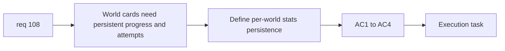

## item_377_define_per_world_progress_tracking_and_attempt_count_persistence - Define per-world progress tracking and attempt count persistence
> From version: 0.6.1
> Schema version: 1.0
> Status: Ready
> Understanding: 98%
> Confidence: 96%
> Progress: 0%
> Complexity: Medium
> Theme: Progression
> Reminder: Update status/understanding/confidence/progress and linked task references when you edit this doc.

# Problem
- `req_108` also needs a persistence slice for progression state and attempts per world.

# Scope
- In:
- define per-world attempt counting
- define per-world progress indicators
- define persistence ownership in meta progression
- Out:
- world-card final presentation
- five-world naming and scaling rules

# Acceptance criteria
- AC1: The slice defines per-world attempt counting.
- AC2: The slice defines per-world progress indicators suitable for selection cards.
- AC3: The slice defines persistence ownership for those facts in meta progression.
- AC4: The slice keeps the metrics bounded to what the first world-card UI needs.

# AC Traceability
- AC1 -> Scope: attempt counts. Proof: per-world attempt metric explicit.
- AC2 -> Scope: progress facts. Proof: card-suitable indicators defined.
- AC3 -> Scope: persistence. Proof: meta progression ownership explicit.
- AC4 -> Scope: boundedness. Proof: no extra analytics creep.

# Decision framing
- Product framing: Required
- Product signals: clarity, motivation, replay visibility
- Product follow-up: none.
- Architecture framing: Optional
- Architecture signals: meta progression schema extension
- Architecture follow-up: none yet.

# Links
- Product brief(s): (none yet)
- Architecture decision(s): (none yet)
- Request: `req_108_define_a_five_world_unlock_ladder_with_world_scaling_and_richer_world_selection_cards`
- Primary task(s): `task_071_orchestrate_mission_progression_world_ladder_and_main_screen_background_wave`

# AI Context
- Summary: Define the persistent progress facts needed to render richer world cards.
- Keywords: attempts, world progress, meta progression, persistence
- Use when: Use when implementing req 108 progress and attempt tracking.
- Skip when: Skip when working only on world names or art.

# References
- `src/app/model/metaProgression.ts`
- `src/shared/lib/runtimeSessionStorage.ts`
