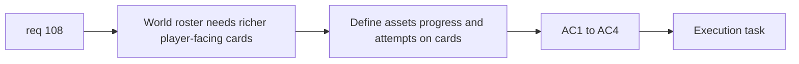

## item_378_define_richer_world_selection_cards_with_representative_assets_progress_and_attempts - Define richer world selection cards with representative assets, progress, and attempts
> From version: 0.6.1
> Schema version: 1.0
> Status: Ready
> Understanding: 98%
> Confidence: 96%
> Progress: 0%
> Complexity: Medium
> Theme: UI
> Reminder: Update status/understanding/confidence/progress and linked task references when you edit this doc.

# Problem
- `req_108` needs a final presentation slice for richer world-selection cards.
- Without it, the world ladder and persistence facts will not feel materially better to players.

# Scope
- In:
- define world cards with representative assets
- show name, lock state, progress indicator, and attempt count
- keep the world-selection surface attractive but readable
- Out:
- full campaign-overworld screen
- lore codex for each world

# Acceptance criteria
- AC1: The slice defines richer world cards as the player-facing selection surface.
- AC2: The slice defines a representative asset on each world card.
- AC3: The slice defines visible progress and attempt count on each world card.
- AC4: The slice keeps the selection screen attractive without becoming cluttered.

# AC Traceability
- AC1 -> Scope: card posture. Proof: world cards explicit.
- AC2 -> Scope: representative assets. Proof: asset coverage explicit.
- AC3 -> Scope: progress and attempts. Proof: both metrics visible.
- AC4 -> Scope: readability. Proof: bounded information density explicit.

# Decision framing
- Product framing: Required
- Product signals: attractiveness, progression clarity
- Product follow-up: may later reuse world-card visuals on other shell surfaces.
- Architecture framing: Optional
- Architecture signals: shell asset resolution and card ownership
- Architecture follow-up: reuse existing asset pipeline unless a world-card asset ADR is later needed.

# Links
- Product brief(s): `prod_017_graphical_asset_direction_for_runtime_readability_and_shell_identity`
- Architecture decision(s): `adr_052_adopt_a_content_driven_graphical_asset_pipeline_for_runtime_and_shell_surfaces`
- Request: `req_108_define_a_five_world_unlock_ladder_with_world_scaling_and_richer_world_selection_cards`
- Primary task(s): `task_071_orchestrate_mission_progression_world_ladder_and_main_screen_background_wave`

# AI Context
- Summary: Define the richer world-card UI and representative-asset posture for req 108.
- Keywords: world cards, representative asset, attempts, progress
- Use when: Use when implementing the player-facing shell part of req 108.
- Skip when: Skip when working only on unlock logic or persistence.

# References
- `src/app/components/AppMetaScenePanel.tsx`
- `src/app/styles/app.css`
- `src/assets/assetCatalog.ts`
