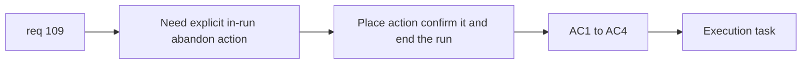

## item_379_define_in_run_abandon_surface_confirmation_and_terminal_outcome - Define in-run abandon surface, confirmation, and terminal outcome
> From version: 0.6.1
> Schema version: 1.0
> Status: Ready
> Understanding: 98%
> Confidence: 96%
> Progress: 0%
> Complexity: Medium
> Theme: UI
> Reminder: Update status/understanding/confidence/progress and linked task references when you edit this doc.

# Problem
- `req_109` needs a clear in-run way to abandon a run.
- Without an explicit surface and terminal outcome, the run-commit posture remains abstract and hard to enforce.

# Scope
- In:
- define where the in-run `Abandon` action lives
- define confirmation posture before abandoning
- define abandon as a terminal run outcome
- define the immediate shell/runtime consequences of confirming abandon
- Out:
- full pause-menu redesign
- broader persistence refactors unrelated to abandon

# Acceptance criteria
- AC1: The slice defines an in-run `Abandon` action on an explicit player-facing surface.
- AC2: The slice defines a confirmation step before the run is abandoned.
- AC3: The slice defines that confirmed abandon ends the active run immediately.
- AC4: The slice keeps the outcome bounded to a terminal run state rather than a hidden debug escape.

# AC Traceability
- AC1 -> Scope: surface ownership. Proof: explicit in-run location documented.
- AC2 -> Scope: confirmation posture. Proof: confirmation requirement documented.
- AC3 -> Scope: terminal outcome. Proof: abandon ends active run.
- AC4 -> Scope: bounded run-state posture. Proof: abandon treated as first-class run ending.

# Decision framing
- Product framing: Required
- Product signals: clarity, safety, run commitment
- Product follow-up: may later tune the exact wording or button placement without changing the posture.
- Architecture framing: Optional
- Architecture signals: shell routing, pause/runtime boundary
- Architecture follow-up: reuse current shell/menu seams unless a larger run-state ADR later becomes necessary.

# Links
- Product brief(s): (none yet)
- Architecture decision(s): (none yet)
- Request: `req_109_define_a_run_commit_posture_with_in_run_abandon_and_no_mid_run_save_load`
- Primary task(s): `task_071_orchestrate_mission_progression_world_ladder_and_main_screen_background_wave`

# AI Context
- Summary: Define the in-run abandon affordance, confirmation, and terminal outcome for req 109.
- Keywords: abandon, run, terminal state, confirmation, in-run UI
- Use when: Use when implementing the player-facing abandon flow.
- Skip when: Skip when only removing save/load behavior under the hood.

# References
- `src/app/AppShell.tsx`
- `src/app/components/AppMetaScenePanel.tsx`
- `games/emberwake/src/runtime/emberwakeSession.ts`
