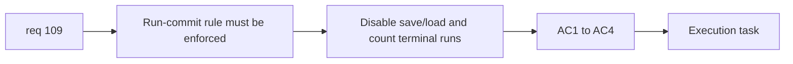

## item_380_define_no_mid_run_save_load_enforcement_and_attempt_accounting - Define no mid-run save/load enforcement and attempt accounting
> From version: 0.6.1
> Schema version: 1.0
> Status: Done
> Understanding: 98%
> Confidence: 96%
> Progress: 100%
> Complexity: Medium
> Theme: Progression
> Reminder: Update status/understanding/confidence/progress and linked task references when you edit this doc.

# Problem
- `req_109` also needs the actual run-commit rule to be enforced.
- If save/load remains available in behavior or accounting, the abandon button alone does not solve the progression ambiguity.

# Scope
- In:
- define that active runs cannot be saved mid-run
- define that active runs cannot be loaded mid-run
- define that runs count once they conclude through death or abandon
- define the minimum persistence/accounting posture needed for attempts and progression facts
- Out:
- full persistence architecture rewrite
- meta progression redesign unrelated to concluded-run accounting

# Acceptance criteria
- AC1: The slice defines that active runs cannot be saved mid-run.
- AC2: The slice defines that active runs cannot be loaded mid-run.
- AC3: The slice defines that runs are counted once they conclude through death or abandon.
- AC4: The slice keeps meta progression persistence only to the extent needed for correct concluded-run accounting.

# AC Traceability
- AC1 -> Scope: no mid-run save. Proof: save disabled posture explicit.
- AC2 -> Scope: no mid-run load. Proof: load disabled posture explicit.
- AC3 -> Scope: concluded-run accounting. Proof: death and abandon both counted.
- AC4 -> Scope: bounded persistence impact. Proof: no broad persistence redesign required.

# Decision framing
- Product framing: Required
- Product signals: progression clarity, fair attempt counting
- Product follow-up: analytics distinctions between death and abandon may come later without changing the counting rule.
- Architecture framing: Required
- Architecture signals: run persistence ownership, attempt recording, terminal-state bookkeeping
- Architecture follow-up: add a companion ADR only if implementation reveals a real persistence fork.

# Links
- Product brief(s): (none yet)
- Architecture decision(s): (none yet)
- Request: `req_109_define_a_run_commit_posture_with_in_run_abandon_and_no_mid_run_save_load`
- Primary task(s): `task_071_orchestrate_mission_progression_world_ladder_and_main_screen_background_wave`

# AI Context
- Summary: Define save/load removal for active runs and the counting posture for death/abandon-concluded runs.
- Keywords: save, load, run, attempts, persistence, abandon, death
- Use when: Use when implementing the behavior and accounting part of req 109.
- Skip when: Skip when only placing the abandon button in the shell.

# References
- `src/app/model/metaProgression.ts`
- `games/emberwake/src/runtime/emberwakeSession.ts`
- `src/app/AppShell.tsx`
