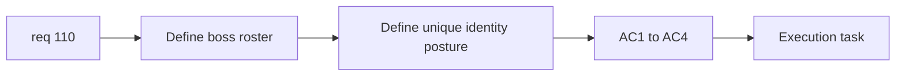

## item_381_define_exact_boss_asset_roster_and_unique_visual_identity_posture - Define exact boss asset roster and unique visual identity posture
> From version: 0.6.1+c2d57bc
> Schema version: 1.0
> Status: Draft
> Understanding: 100%
> Confidence: 98%
> Progress: 5%
> Complexity: Small
> Theme: Graphics
> Reminder: Update status/understanding/confidence/progress and linked task references when you edit this doc.

# Problem
- `req_110` first needs an exact boss roster and a clear identity posture before any generation wave starts.
- Without that framing, generation will drift back toward recolored base-hostile variants.

# Scope
- In:
- define the exact current boss roster to cover
- define the unique identity target for each boss
- define where family lineage is preserved and where divergence is required
- Out:
- image generation itself
- runtime promotion/integration work

# Acceptance criteria
- AC1: The slice defines the exact boss roster for this wave.
- AC2: The slice explicitly includes `watchglass-prime`, `mission-boss-sentinel`, `mission-boss-watchglass`, and `mission-boss-rammer`.
- AC3: The slice defines a unique identity target for each boss that goes beyond tint and scale alone.
- AC4: The slice stays at framing level and does not silently broaden into generation or runtime integration.

# AC Traceability
- AC1 -> Scope: roster definition. Proof: boss list explicit.
- AC2 -> Scope: named boss coverage. Proof: all four boss ids present.
- AC3 -> Scope: identity posture. Proof: per-boss differentiation explicit.
- AC4 -> Scope: bounded framing. Proof: no implementation scope creep.

# Decision framing
- Product framing: Required
- Product signals: boss distinctness, encounter readability
- Product follow-up: may later expand to boss-specific FX or encounter splash treatments.
- Architecture framing: Optional
- Architecture signals: asset-id naming and ownership boundaries
- Architecture follow-up: reuse existing asset pipeline unless a stronger contract change becomes necessary.

# Links
- Product brief(s): `prod_017_graphical_asset_direction_for_runtime_readability_and_shell_identity`
- Architecture decision(s): `adr_052_adopt_a_content_driven_graphical_asset_pipeline_for_runtime_and_shell_surfaces`
- Request: `req_110_define_unique_generated_runtime_assets_for_every_boss_type`
- Primary task(s): `task_072_orchestrate_unique_boss_asset_generation_and_integration_wave`, `task_073_orchestrate_boss_cleanup_seed_archive_and_crystal_persistence_wave`

# AI Context
- Summary: Define the exact boss roster and identity posture required before generating unique boss assets.
- Keywords: boss roster, visual identity, watchglass-prime, mission boss
- Use when: Use when preparing boss-specific asset generation.
- Skip when: Skip when already in the implementation/generation phase.

# References
- `games/emberwake/src/runtime/hostilePressure.ts`
- `games/emberwake/src/runtime/entitySimulation.ts`
- `games/emberwake/src/runtime/missionLoop.ts`
