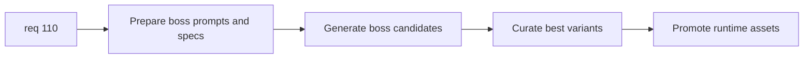

## item_382_define_unique_boss_asset_generation_and_promotion_workflow - Define unique boss asset generation and promotion workflow
> From version: 0.6.1+c2d57bc
> Schema version: 1.0
> Status: Draft
> Understanding: 99%
> Confidence: 97%
> Progress: 5%
> Complexity: Medium
> Theme: Graphics
> Reminder: Update status/understanding/confidence/progress and linked task references when you edit this doc.

# Problem
- `req_110` needs an explicit generation workflow to turn the boss roster into real promoted assets.
- Without a bounded promotion path, boss images may remain scratch outputs instead of runtime-owned assets.

# Scope
- In:
- define prompts or production specs for each boss
- generate boss candidates
- curate selections
- promote them into runtime asset locations
- Out:
- shell/runtime mapping changes beyond what is required to consume the promoted files
- redesigning the full asset workflow for every entity family

# Acceptance criteria
- AC1: The slice defines a bounded generation workflow for each boss in the roster.
- AC2: The slice defines promotion of the selected boss variants into real runtime asset paths.
- AC3: The slice keeps the existing drop-in asset contract as the delivery baseline.
- AC4: The slice stays focused on generation and promotion rather than broad runtime/shell refactors.

# AC Traceability
- AC1 -> Scope: generation workflow. Proof: boss-specific prompt/generation path explicit.
- AC2 -> Scope: promotion. Proof: promoted runtime destinations explicit.
- AC3 -> Scope: drop-in contract. Proof: existing pipeline retained.
- AC4 -> Scope: bounded workflow. Proof: integration deferred to another slice.

# Decision framing
- Product framing: Optional
- Product signals: boss visual quality, boss distinctness
- Product follow-up: may later add review galleries or generation metrics.
- Architecture framing: Required
- Architecture signals: generated asset storage, promotion conventions
- Architecture follow-up: keep reuse of existing scripts unless a boss-specific helper is warranted.

# Links
- Product brief(s): `prod_017_graphical_asset_direction_for_runtime_readability_and_shell_identity`
- Architecture decision(s): `adr_052_adopt_a_content_driven_graphical_asset_pipeline_for_runtime_and_shell_surfaces`
- Request: `req_110_define_unique_generated_runtime_assets_for_every_boss_type`
- Primary task(s): `task_072_orchestrate_unique_boss_asset_generation_and_integration_wave`, `task_073_orchestrate_boss_cleanup_seed_archive_and_crystal_persistence_wave`

# AI Context
- Summary: Define the generation, curation, and promotion workflow for unique boss assets.
- Keywords: boss generation, prompts, promotion, runtime assets
- Use when: Use when turning boss asset intent into actual files.
- Skip when: Skip when only adjusting runtime mapping or shell presentation.

# References
- `logics/specs/spec_001_define_first_wave_asset_production_pack.md`
- `scripts/assets/generateFirstWaveAssets.mjs`
- `scripts/assets/promoteFirstWaveAssets.mjs`
- `src/assets/README.md`
