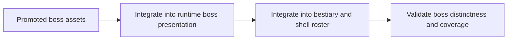

## item_383_define_unique_boss_asset_runtime_shell_integration_and_validation - Define unique boss asset runtime, shell integration, and validation
> From version: 0.6.1+b927df6
> Schema version: 1.0
> Status: Done
> Understanding: 100%
> Confidence: 99%
> Progress: 100%
> Complexity: Medium
> Theme: Graphics
> Reminder: Update status/understanding/confidence/progress and linked task references when you edit this doc.

# Problem
- After boss assets are promoted, the runtime and shell still need to consume them explicitly.
- Without this slice, bosses may keep showing base hostile assets in the encounter, bestiary, or boss-inclusive shell rosters.

# Scope
- In:
- wire the unique boss assets into the relevant runtime boss entities
- wire the unique boss assets into shell surfaces that show boss identities
- validate boss appearance in runtime and bestiary
- Out:
- new boss mechanics
- a broader shell redesign

# Acceptance criteria
- AC1: The slice defines runtime integration so boss entities consume their unique assets.
- AC2: The slice defines shell integration for boss appearances in bestiary and other boss-inclusive shell rosters.
- AC3: The slice validates that bosses no longer read only as tinted/scaled base hostile assets.
- AC4: The slice stays bounded to integration and validation rather than opening a new combat-design wave.

# AC Traceability
- AC1 -> Scope: runtime integration. Proof: boss entity mapping explicit.
- AC2 -> Scope: shell integration. Proof: bestiary and shell coverage explicit.
- AC3 -> Scope: validation. Proof: distinctness review explicit.
- AC4 -> Scope: bounded integration. Proof: no mechanics scope creep.

# Decision framing
- Product framing: Required
- Product signals: boss recognizability, bestiary consistency, main-menu boss presence quality
- Product follow-up: optional future boss-specific shell cards or codex flavor.
- Architecture framing: Required
- Architecture signals: entity visual resolution seams, shell asset ownership
- Architecture follow-up: add helper mapping only if current hostile/boss ownership remains too implicit.

# Links
- Product brief(s): `prod_017_graphical_asset_direction_for_runtime_readability_and_shell_identity`
- Architecture decision(s): `adr_052_adopt_a_content_driven_graphical_asset_pipeline_for_runtime_and_shell_surfaces`
- Request: `req_110_define_unique_generated_runtime_assets_for_every_boss_type`
- Primary task(s): `task_072_orchestrate_unique_boss_asset_generation_and_integration_wave`, `task_073_orchestrate_boss_cleanup_seed_archive_and_crystal_persistence_wave`

# AI Context
- Summary: Define the runtime and shell integration slice for unique boss assets and validate that the bosses now read as distinct entities.
- Keywords: boss asset integration, runtime, bestiary, shell, validation
- Use when: Use when promoted boss assets are ready to be consumed.
- Skip when: Skip when only generating boss image candidates.

# References
- `games/emberwake/src/runtime/entitySimulation.ts`
- `games/emberwake/src/runtime/hostilePressure.ts`
- `src/app/components/CodexArchiveScene.tsx`
- `src/app/components/AppMetaScenePanel.tsx`

# Outcome
- Boss runtime entities now resolve boss-specific visual kinds and assets.
- The bestiary and boss-inclusive main-menu enemy roster now consume the boss-specific assets rather than base hostile families.
