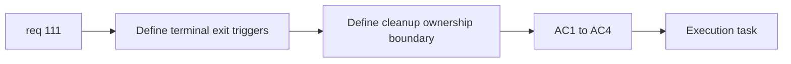

## item_384_define_terminal_run_cleanup_triggers_and_runtime_ownership_boundaries - Define terminal run cleanup triggers and runtime ownership boundaries
> From version: 0.6.1+fe22026
> Schema version: 1.0
> Status: Done
> Understanding: 100%
> Confidence: 99%
> Progress: 100%
> Complexity: Small
> Theme: Performance
> Reminder: Update status/understanding/confidence/progress and linked task references when you edit this doc.

# Problem
- `req_111` first needs a clean definition of which exits are terminal and what runtime-owned memory is eligible for teardown.
- Without that ownership boundary, cleanup work risks breaking resumable flows or missing the real retainers.

# Scope
- In:
- define terminal exit triggers such as abandon, defeat-to-main-menu, and victory-to-main-menu
- define the runtime-owned state families eligible for cleanup
- define the shell/meta state that must survive cleanup
- Out:
- instrumentation and memory validation detail
- low-level renderer teardown mechanics

# Acceptance criteria
- AC1: The slice defines which return-to-main-screen paths are terminal cleanup triggers.
- AC2: The slice defines the runtime-owned state families eligible for cleanup.
- AC3: The slice defines which shell/meta state must remain intact.
- AC4: The slice stays at trigger and ownership framing level.

# AC Traceability
- AC1 -> Scope: trigger list. Proof: terminal exits named explicitly.
- AC2 -> Scope: runtime ownership boundary. Proof: cleanup candidates listed.
- AC3 -> Scope: retained state boundary. Proof: preserved shell/meta state explicit.
- AC4 -> Scope: bounded framing. Proof: no instrumentation creep.

# Decision framing
- Product framing: Required
- Product signals: reliable main-menu returns, no broken resume flows
- Product follow-up: none required before implementation.
- Architecture framing: Required
- Architecture signals: runtime/session ownership, terminal-state teardown seam
- Architecture follow-up: add deeper teardown notes only if implementation reveals a new boundary.

# Links
- Product brief(s): (none yet)
- Architecture decision(s): (none yet)
- Request: `req_111_define_a_terminal_run_memory_cleanup_posture_when_returning_to_main_screen`
- Primary task(s): `task_073_orchestrate_boss_cleanup_seed_archive_and_crystal_persistence_wave`

# AI Context
- Summary: Define the terminal cleanup triggers and ownership boundary for req 111 before teardown work starts.
- Keywords: cleanup triggers, terminal exit, ownership, runtime memory
- Use when: Use when framing terminal-run cleanup work.
- Skip when: Skip when already implementing validation or teardown mechanics.

# References
- `src/app/AppShell.tsx`
- `src/app/model/appScene.ts`
- `src/shared/lib/runtimeSessionStorage.ts`

# Outcome
- Terminal triggers remain bounded to abandon, victory-to-main-menu, and defeat-to-main-menu.
- Cleanup ownership now clearly targets runtime session state, renderer references, recap/outcome state, and other run-owned shell memory while preserving meta progression and world selection.
