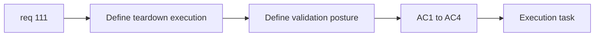

## item_385_define_terminal_run_cleanup_validation_and_teardown_execution_posture - Define terminal run cleanup validation and teardown execution posture
> From version: 0.6.1+fe22026
> Schema version: 1.0
> Status: Done
> Understanding: 100%
> Confidence: 99%
> Progress: 100%
> Complexity: Medium
> Theme: Performance
> Reminder: Update status/understanding/confidence/progress and linked task references when you edit this doc.

# Problem
- After the trigger boundary is set, `req_111` still needs a bounded execution and validation posture for actual cleanup.
- Without explicit validation, cleanup can look correct while retaining textures, session state, or simulation data.

# Scope
- In:
- define the teardown execution posture for terminal runs
- define how runtime/session resources should be released or reset
- define the validation posture for confirming material cleanup
- Out:
- broad browser-level GC guarantees
- a full memory profiler product feature

# Acceptance criteria
- AC1: The slice defines the bounded teardown posture for terminal run exits.
- AC2: The slice defines how runtime/session resources should be released or reset.
- AC3: The slice defines a practical validation posture for confirming cleanup happened materially better than before.
- AC4: The slice stays bounded to app-owned teardown and validation.

# AC Traceability
- AC1 -> Scope: teardown posture. Proof: terminal cleanup execution explicit.
- AC2 -> Scope: resource release. Proof: reset/release ownership stated.
- AC3 -> Scope: validation. Proof: practical checks identified.
- AC4 -> Scope: app boundary. Proof: no browser-GC overreach.

# Decision framing
- Product framing: Optional
- Product signals: none beyond stable UX after terminal exits
- Product follow-up: none.
- Architecture framing: Required
- Architecture signals: session teardown, renderer resource release, measurable cleanup
- Architecture follow-up: add a deeper ADR only if teardown becomes cross-cutting.

# Links
- Product brief(s): (none yet)
- Architecture decision(s): (none yet)
- Request: `req_111_define_a_terminal_run_memory_cleanup_posture_when_returning_to_main_screen`
- Primary task(s): `task_073_orchestrate_boss_cleanup_seed_archive_and_crystal_persistence_wave`

# AI Context
- Summary: Define teardown execution and validation posture for terminal-run cleanup.
- Keywords: teardown, validation, memory cleanup, runtime session
- Use when: Use when implementing req 111 end to end.
- Skip when: Skip when only scoping cleanup triggers.

# References
- `src/app/AppShell.tsx`
- `src/app/components/ActiveRuntimeShellContent.tsx`
- `src/shared/config/runtimePerformanceBudget.json`

# Outcome
- The teardown execution posture now resets run-owned shell memory immediately after terminal handoff and restores the session to a clean baseline for the next run.
- Validation coverage includes `AppShell` terminal-return behavior and runtime session seed/state tests.
