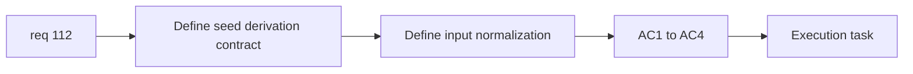

## item_386_define_player_world_seed_derivation_contract_and_input_normalization - Define player/world seed derivation contract and input normalization
> From version: 0.6.1+fe22026
> Schema version: 1.0
> Status: Done
> Understanding: 100%
> Confidence: 99%
> Progress: 100%
> Complexity: Small
> Theme: Progression
> Reminder: Update status/understanding/confidence/progress and linked task references when you edit this doc.

# Problem
- `req_112` needs an explicit derivation contract before bootstrap code changes begin.
- Without that contract, seed behavior can drift across name normalization or world-id usage.

# Scope
- In:
- define `derivedSeed = f(normalizedPlayerName, selectedWorldProfileId)`
- define name normalization posture
- define deterministic replay expectation for repeated inputs
- Out:
- session bootstrap plumbing
- broader procedural-generation redesign

# Acceptance criteria
- AC1: The slice defines the derivation contract for player name plus world id.
- AC2: The slice defines the player-name normalization posture.
- AC3: The slice defines deterministic behavior for repeated identical inputs.
- AC4: The slice remains at contract level.

# AC Traceability
- AC1 -> Scope: derivation rule. Proof: explicit function-style contract.
- AC2 -> Scope: normalization. Proof: normalized name rule named.
- AC3 -> Scope: determinism. Proof: repeated-input expectation explicit.
- AC4 -> Scope: bounded framing. Proof: no bootstrap creep.

# Decision framing
- Product framing: Required
- Product signals: intuitive determinism, stable world identity
- Product follow-up: none before bootstrap work.
- Architecture framing: Required
- Architecture signals: world-profile id stability, seed contract ownership
- Architecture follow-up: none unless seed versioning later appears.

# Links
- Product brief(s): (none yet)
- Architecture decision(s): (none yet)
- Request: `req_112_define_the_map_seed_as_a_function_of_player_name_and_selected_world`
- Primary task(s): `task_073_orchestrate_boss_cleanup_seed_archive_and_crystal_persistence_wave`

# AI Context
- Summary: Define the exact seed derivation contract and input normalization for req 112.
- Keywords: seed contract, normalized player name, world id, determinism
- Use when: Use when preparing map seed derivation work.
- Skip when: Skip when already wiring bootstrap/session code.

# References
- `src/app/model/characterName.ts`
- `src/shared/model/worldProfiles.ts`

# Outcome
- The delivered seed contract is `derivedSeed = worldBaseSeed + "::runner:" + hash(worldProfileId + normalizedPlayerName)`.
- The same normalized player name and selected world now deterministically reproduce the same run seed.
