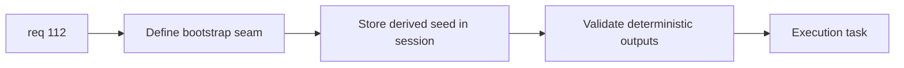

## item_387_define_runtime_session_seed_bootstrap_and_deterministic_validation - Define runtime session seed bootstrap and deterministic validation
> From version: 0.6.1+fe22026
> Schema version: 1.0
> Status: Done
> Understanding: 100%
> Confidence: 99%
> Progress: 100%
> Complexity: Medium
> Theme: Progression
> Reminder: Update status/understanding/confidence/progress and linked task references when you edit this doc.

# Problem
- Once the derivation contract exists, `req_112` still needs the session/bootstrap seam and deterministic validation.
- Without that integration slice, the contract can exist on paper while runtime still uses old seed behavior.

# Scope
- In:
- define where derived seeds are created during new-game bootstrap
- define how the derived seed is stored in the runtime session
- define deterministic validation for repeated player/world inputs
- Out:
- debug seed UI
- unrelated world-selection redesign

# Acceptance criteria
- AC1: The slice defines where derived seeds are created before runtime start.
- AC2: The slice defines how the derived seed is stored in session/runtime ownership.
- AC3: The slice defines deterministic validation for repeated identical inputs.
- AC4: The slice stays bounded to bootstrap/session integration.

# AC Traceability
- AC1 -> Scope: derivation seam. Proof: creation point explicit.
- AC2 -> Scope: session ownership. Proof: stored seed path explicit.
- AC3 -> Scope: deterministic validation. Proof: replay checks identified.
- AC4 -> Scope: bounded integration. Proof: no UI creep.

# Decision framing
- Product framing: Optional
- Product signals: consistent new-game experience
- Product follow-up: none.
- Architecture framing: Required
- Architecture signals: session bootstrap, storage, deterministic runtime initialization
- Architecture follow-up: none unless seed versioning later appears.

# Links
- Product brief(s): (none yet)
- Architecture decision(s): (none yet)
- Request: `req_112_define_the_map_seed_as_a_function_of_player_name_and_selected_world`
- Primary task(s): `task_073_orchestrate_boss_cleanup_seed_archive_and_crystal_persistence_wave`

# AI Context
- Summary: Define bootstrap/session integration and validation for player/world-derived seeds.
- Keywords: session bootstrap, derived seed, deterministic validation, new game
- Use when: Use when implementing req 112.
- Skip when: Skip when only framing seed contract semantics.

# References
- `src/app/AppShell.tsx`
- `src/shared/lib/runtimeSessionStorage.ts`
- `games/emberwake/src/runtime/emberwakeSession.ts`

# Outcome
- Runtime session bootstrap now stores a derived run seed when a new session starts.
- World-profile lookup remains deterministic for derived seeds because runtime systems resolve the authored world base from the derived seed prefix.
