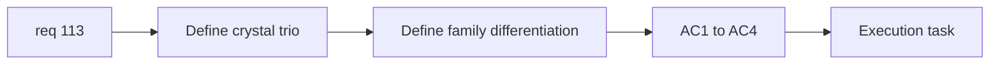

## item_388_define_three_crystal_asset_roster_and_family_differentiation_posture - Define three crystal asset roster and family differentiation posture
> From version: 0.6.1+c2d57bc
> Schema version: 1.0
> Status: Draft
> Understanding: 98%
> Confidence: 96%
> Progress: 0%
> Complexity: Small
> Theme: Graphics
> Reminder: Update status/understanding/confidence/progress and linked task references when you edit this doc.

# Problem
- `req_113` needs an explicit three-crystal roster and differentiation posture before generation starts.
- Without that framing, the generated variants may stay too close or drift away from a coherent crystal family.

# Scope
- In:
- define the exact three crystal types to cover
- define family-level visual cohesion and tier differentiation
- define the expected readability differences between the three assets
- Out:
- generation pipeline execution
- runtime promotion/integration mechanics

# Acceptance criteria
- AC1: The slice defines the exact three crystal types in scope.
- AC2: The slice defines how the three variants remain one family.
- AC3: The slice defines how each crystal remains visually distinguishable at gameplay scale.
- AC4: The slice stays at framing level.

# AC Traceability
- AC1 -> Scope: exact trio. Proof: three crystal types named.
- AC2 -> Scope: family cohesion. Proof: common shape/material posture explicit.
- AC3 -> Scope: differentiation. Proof: tier readability criteria explicit.
- AC4 -> Scope: bounded framing. Proof: no implementation creep.

# Decision framing
- Product framing: Required
- Product signals: pickup readability, tier clarity
- Product follow-up: none before generation.
- Architecture framing: Optional
- Architecture signals: asset ids and family naming
- Architecture follow-up: none.

# Links
- Product brief(s): `prod_017_graphical_asset_direction_for_runtime_readability_and_shell_identity`
- Architecture decision(s): `adr_052_adopt_a_content_driven_graphical_asset_pipeline_for_runtime_and_shell_surfaces`
- Request: `req_113_define_three_distinct_generated_assets_for_the_three_crystal_types`
- Primary task(s): `task_073_orchestrate_boss_cleanup_seed_archive_and_crystal_persistence_wave`

# AI Context
- Summary: Define the exact crystal trio and the differentiation posture before generation.
- Keywords: crystal trio, crystal family, tier readability, pickup art
- Use when: Use when preparing crystal asset generation.
- Skip when: Skip when already executing generation or runtime integration.

# References
- `games/emberwake/src/content/entities/entityData.ts`
- `src/assets/assetCatalog.ts`
